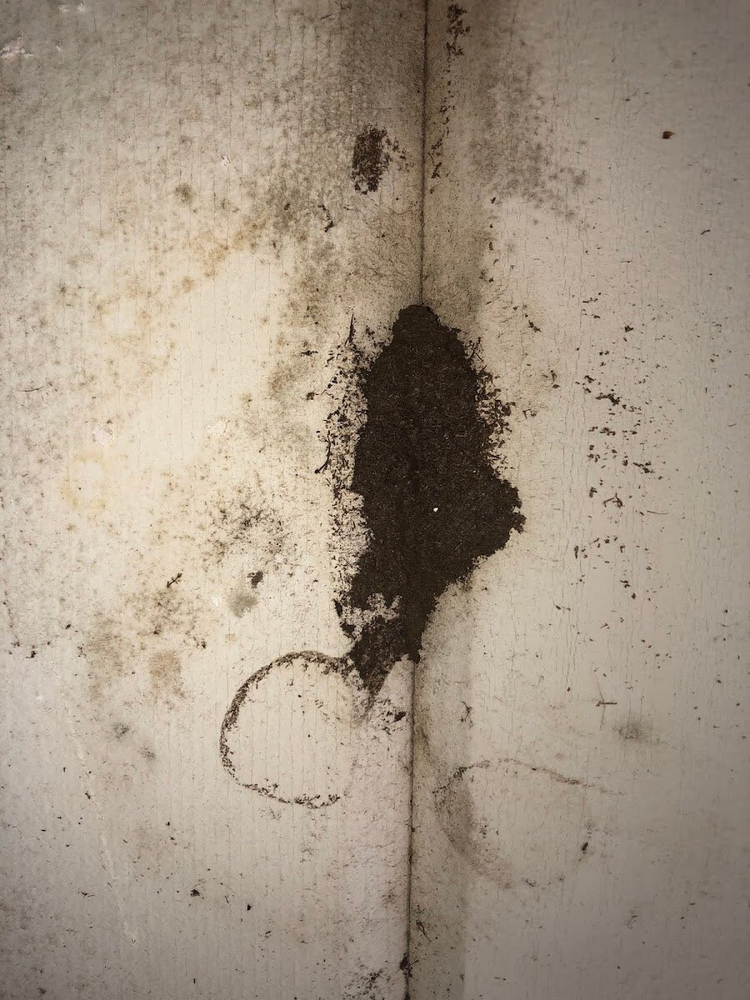
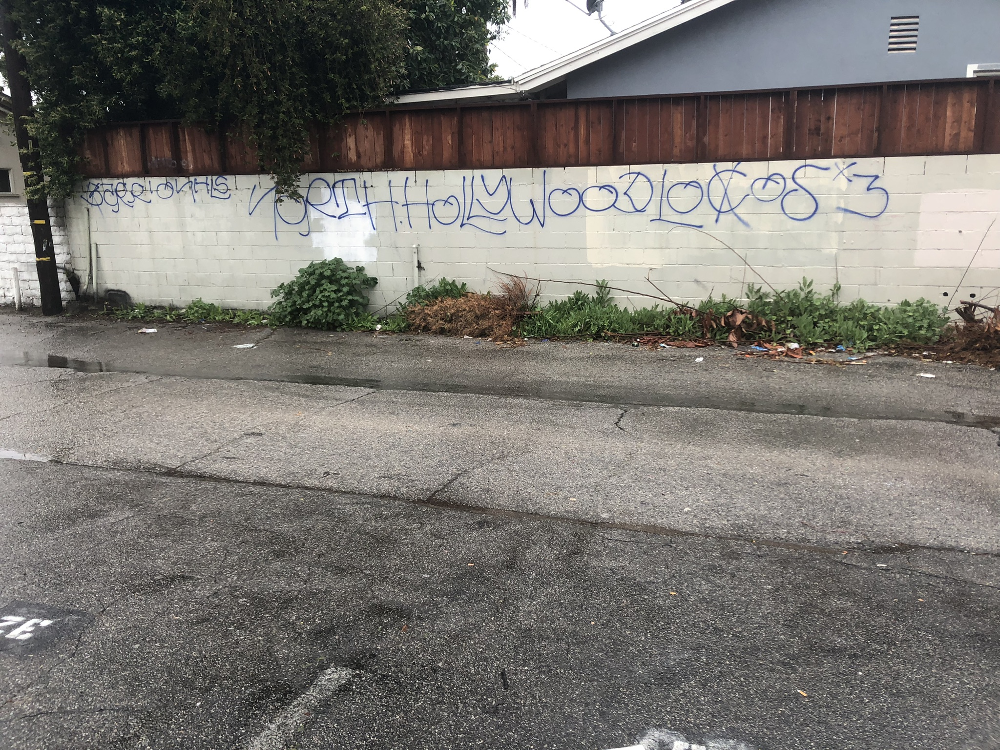

# THE CONSTRUCTIVE EVICTION LOOPHOLE:

## TABLE OF CONTENTS

1. [<span style="color:skyblue">BACKSTORY</span>](#BACKSTORY)

2. [<span style="color:skyblue">THE ISSUES OF CONCERN</span>](#THE_ISSUES_OF_CONCERN)
   
      - [<span style="color:yellow">VIDEO PROOF</span> <span style="color:white">HOUSING DEPARTMENTS</span> <span style="color:yellow">INSPECTOR WORKING <span style="color:white">WITH</span> SLUMLORDS</span>](#VIDEO_PROOF)
        
      - [<span style="color:yellow">MORE</span> <span style="color:white">OF</span> <span style="color:white">INSPECTOR </span> <span style="color:yellow">LUKE DEASY\'S</span> <span style="color:yellow">WORK</span>](#DEASYS_HANDY_WORK)

3. [<span style="color:skyblue">"SIGNIFICANT" VS "SUFFICIENT" - DOES IT MATTER</span>](#SIGNIFICANT_VS_SUFFICIENT)
4. [<span style="color:skyblue">THE CONTRUCTIVE EVICTION LOOPHOLE</span>](#THE_CONTRUCTIVE_EVICTION_LOOPHOLE)

    * [<span style="color:yellow">EXAMPLE</span> <span style="color:white">OF</span> <span style="color:yellow">THE CONSTRUCTIVE EVICTION LOOPHOLE</span> <span style="color:white">IN</span> <span style="color:yellow">ACTION</span>](#CONSTRUCTIVE_EVICTION_LOOPHOLE_EXAMPLE)

    * [<span style="color:yellow">LACK</span> <span style="color:white">OF</span> <span style="color:yellow">CODE</span> <span style="color:yellow">ENFORCEMENT</span>](#CODE_ENFORCEMENT_ISSUE)

    * [<span style="color:yellow">2018 AUDIT</span> <span style="color:white">OUTLINED</span> <span style="color:yellow">THE CONTRUCTIVE EVICTION LOOPHOLE</span> <span style="color:white">TO LEADERS</span>](#2018_AUDIT_OUTLINED_LOOPHOLE)
       
        * [<span style="color:white">LAHD</span> <span style="color:yellow">IS GAMING THE SYSTEM</span> <span style="color:white">TO MEET</span> <span style="color:yellow">STAT GOALS</span>](#LAHD_IS_COOKING_STATS)
    
    * [<span style="color:yellow">WHAT</span> <span style="color:white">DOES </span> <span style="color:yellow">THE CONSTRUCTIVE EVICTION LOOPHOLE</span> <span style="color:white">LOOK LIKE</span>](#WHAT_DOES_CONSTRUCTIVE_EVICTION_LOOPHOLE_LOOK_LIKE)
        
        * [<span style="color:yellow">WHAT</span> <span style="color:white">IS</span> <span style="color:yellow">THE LOCKOUT STRATEGY</span>](#WHAT_IS_THE_LOCKOUT_STRATEGY)
       
        * [<span style="color:yellow">WHAT</span> <span style="color:white">DOES <span style="color:yellow">THE</span></span> <span style="font-weight:bolder;color:red">ABUSE</span> <span style="color:white">LOOK</span> <span style="color:yellow">LIKE</span>](#WHAT_DOES_THE_ABUSE_LOOK_LIKE)
    
    * [<span style="color:yellow">CITY OFFICIALS</span> <span style="color:white">COULDN'T GET</span> <span style="color:yellow">LAHD</span> <span style="color:white">TO DO THE</span> <span style="color:yellow">RIGHT THING</span>](#CITY_OFFICIALS_COULDNT_GET_LAHD_TO_FIX_IT)
    
    * [<span style="color:yellow">RELATION</span> <span style="color:white">TO FIXING</span> <span style="color:yellow">SYSTEMIC CLASSISM</span> <span style="color:white"><u>AND</u></span> <span style="color:yellow">RACISM</span>](#RELATION_TO_FIXING_SYSTEMIC_CLASSISM_AND_RACISM) :loudspeaker:
    
    * [<span style="color:white">LOS ANGELES <span style="color:yellow">HOUSING</span> DEPARTMENTS (<span style="color:yellow">LAHD's</span>) ROLE</span>](#LAHDs_ROLE)
        
        * [<span style="color:white">LAHD <span style="color:yellow">ACTIVELY CREATES HOMELESS</span> PEOPLE</span>](#LAHD_ACTIVELY_CREATES_HOMELESS)
        
        * [<span style="color:white">LAHD <span style="color:yellow">REFUSES TO PERFORM</span> HIGHER LEVEL <span style="color:yellow">INSPECTIONS</span> (SCEP)</span>](#LAHD_REFUSES_TO_PERFORM_INSPECTIONS)
        
        * [<span style="color:white">WE <span style="color:yellow">PAY</span> FOR THESE <span style="color:yellow">HIGHER LEVEL INSPECTIONS</span> (SCEP)</span>](#WE_PAY_FOR_HIGHER_LEVEL_INSPECTIONS)
        
        * [<span style="color:white">LAHD <span style="color:yellow">REFUSES TO ENFORCE</span> CODES</span>](#LAHD_REFUSES_TO_ENFORCE_CODES)
        
        * [<span style="color:white">LAHD <span style="color:yellow">BLOCKS</span> LA CONTROLLER <span style="color:yellow">AND</span> COUNCIL PRESIDENT\'S TEAM <span style="color:yellow">FROM INSPECTION</span></span>](#LAHD_BLOCKS_CITY_TEAMS_FROM_INSPECTION)

5. [<span style="color:skyblue">THIS LOOPHOLE ENABLES ENDLESS TENANT HARASSMENT & ABUSE</span>](#LOOPHOLE_ENABLES_ENDLESS_HARASSMENT_&_ABUSE)

6. [<span style="color:skyblue">SLUMDLORDS PAY GANG MEMBERS TO TERRORIZE AND REMOVE TENANTS</span>](#SLUMDLORDS_PAY_GANG_MEMBERS_TO_REMOVE_TENANTS)
    
    * [<span style="color:yellow">15 DEAD</span> <span style="color:white">-</span> <span style="color:white">CITY OFFICIAL</span> <span style="color:yellow">MIKE FEUER</span> <span style="color:white">AND</span> <span style="color:yellow">13100 VANOWEN</span>](#MIKE_FEUERS_ROLE_IN_13100_VANOWEN)
    
    * [<span style="color:white"><span style="color:yellow">WHAT HAPPENED</span> TO <span style="color:yellow">MIKE FEUER'S</span> <span style="color:white">WORK</span> <span style="color:yellow">AFTER</span> <span style="color:yellow">HE</span> LEFT <span style="color:yellow">OFFICE</span></span>](#MIKE_FEUERS_WORK_AFTER_HE_LEFT_OFFICE)

7. [<span style="color:skyblue">HOW DOES THIS EVICTION LOOPHOLE AFFECT US ALL - REGARDLESS OF CLASS LEVEL</span>](#HOW_DOES_THIS_EVICTION_LOOPHOLE_AFFECT_US_ALL)

8. [<span style="color:skyblue">WHY ARE LAWYERS USELESS AGAINST THE CONTRUCTIVE EVICTION LOOPHOLE</span>](#WHY_ARE_LAWYERS_USELESS)

9. [<span style="color:skyblue">WHY THIS IS NOT A CIVIL MATTER</span>](#WHY_THIS_IS_NOT_A_CIVIL_MATTER)

10. [<span style="color:skyblue">CALL TO ACTION</span>](#CALL_TO_ACTION)
    
    * [<span style="color:white"><span style="color:yellow">WHAT</span> CAN <span style="color:yellow">YOU</span> DO <span style="color:yellow">TO FIGHT</span> SLUMLORDS <span style="color:yellow">FROM YOUR</span> DEVICE</span></span>](#WHAT_CAN_YOU_DO_TO_FIGHT_SLUMLORDS_FROM_YOUR_DEVICE)

    * [<span style="color:white"><span style="color:yellow">PHASE 1</span>: REQUEST A <span style="color:yellow">TENANT ABUSE HOTLINE</span> BE <span style="color:yellow">CREATED</span></span>](#PHASE_1)

        * [<span style="color:white">SOCIAL MEDIA <span style="color:yellow">POSTS</span> FOR <span style="color:yellow">TENANT ABUSE HOTLINE</span></span>](#TENANT_ABUSE_HOTLINE_SOCIAL_MEDIA_POSTS)
            
            * [<span style="color:white"><span style="color:yellow">TWITTER</span> MESSAGE TO SEND FOR <span style="color:yellow">TENANT ABUSE HOTLINE</span></span>](#HOTLINE_RELATED_TWITTER_MESSAGE)
            
            * [<span style="color:white"><span style="color:yellow">INSTAGRAM</span> MESSAGE TO SEND FOR <span style="color:yellow">TENANT ABUSE HOTLINE</span></span>](#HOTLINE_RELATED_INSTAGRAM_MESSAGE)

            * [<span style="color:white"><span style="color:yellow">FACEBOOK</span> MESSAGE TO SEND FOR <span style="color:yellow">TENANT ABUSE HOTLINE</span></span>](#HOTLINE_RELATED_FACEBOOK_MESSAGE)

        * [<span style="color:white"><span style="color:yellow">EMAIL</span> MESSAGE TO SEND FOR <span style="color:yellow">TENANT ABUSE HOTLINE</span></span>](#HOTLINE_RELATED_EMAIL_MESSAGE)

    * [<span style="color:white"><span style="color:yellow">PHASE 2</span>: DEMAND <span style="color:yellow">HOUSING DEPARTMENT</span> DEFINE "<span style="color:yellow">SIGNIFICANT PROGRESS</span>" AS CLEAR <span style="color:yellow">PERCENTAGE VALUE</span></span>](#PHASE_2)

        * [<span style="color:white">SOCIAL MEDIA <span style="color:yellow">POSTS</span> TO <span style="color:yellow">DEFINE SIGNIFICANT PROGRESS</span></span>](#DEFINE_SIGNIFICANT_PROGRESS_SOCIAL_MEDIA_POSTS)
                            
            * [<span style="color:white"><span style="color:yellow">TWITTER</span> MESSAGE TO SEND TO <span style="color:yellow">DEFINE SIGNIFICANT PROGRESS</span></span>](#SIGNIFICANT_PROGRESS_RELATED_TWITTER_MESSAGE)
            
            * [<span style="color:white"><span style="color:yellow">INSTAGRAM</span> MESSAGE TO SEND TO <span style="color:yellow">DEFINE SIGNIFICANT PROGRESS</span></span>](#SIGNIFICANT_PROGRESS_RELATED_INSTAGRAM_MESSAGE)

            * [<span style="color:white"><span style="color:yellow">FACEBOOK</span> MESSAGE TO SEND TO <span style="color:yellow">DEFINE SIGNIFICANT PROGRESS</span></span>](#SIGNIFICANT_PROGRESS_RELATED_FACEBOOK_MESSAGE)

        * [<span style="color:white"><span style="color:yellow">EMAIL</span> MESSAGE TO SEND TO <span style="color:yellow">DEFINE SIGNIFICANT PROGRESS</span></span>](#SIGNIFICANT_PROGRESS_RELATED_EMAIL_MESSAGE)

    * [<span style="color:white"><span style="color:yellow">PHASE 3</span>: REQUEST AN <span style="color:yellow">INDEPENDENT ANALYSIS</span> OF HOUSING DEPARTMENT'S <span style="color:yellow">WORK CASE <span style="color:white">/</span> REPAIR DATABASE</span></span>](#PHASE_3)

        * [<span style="color:white">SOCIAL MEDIA <span style="color:yellow">POSTS</span> TO <span style="color:yellow">REQUEST INDEPENDENT ANALYSIS</span></span>](#REQUEST_INDEPENDENT_ANALYSIS_SOCIAL_MEDIA_POSTS)
                            
            * [<span style="color:white"><span style="color:yellow">TWITTER</span> MESSAGE TO SEND TO <span style="color:yellow">REQUEST INDEPENDENT ANALYSIS</span></span>](#REQUEST_INDEPENDENT_ANALYSIS_RELATED_TWITTER_MESSAGE)
            
            * [<span style="color:white"><span style="color:yellow">INSTAGRAM</span> MESSAGE TO SEND TO <span style="color:yellow">REQUEST INDEPENDENT ANALYSIS</span></span>](#REQUEST_INDEPENDENT_ANALYSIS_RELATED_INSTAGRAM_MESSAGE)

            * [<span style="color:white"><span style="color:yellow">FACEBOOK</span> MESSAGE TO SEND TO <span style="color:yellow">REQUEST INDEPENDENT ANALYSIS</span></span>](#REQUEST_INDEPENDENT_ANALYSIS_RELATED_FACEBOOK_MESSAGE)

        * [<span style="color:white"><span style="color:yellow">EMAIL</span> MESSAGE TO SEND TO <span style="color:yellow">REQUEST INDEPENDENT ANALYSIS <span style="color:white">OF LAHD'S</span> CASE REPAIR<span style="color:white"> DATABASE</span></span></span>](#REQUEST_INDEPENDENT_ANALYSIS_RELATED_EMAIL_MESSAGE)

    * [<span style="color:white"><span style="color:yellow">PHASE 4</span>: REMOVE <span style="color:yellow">BAD ACTORS</span> - DOUBLE CHECK <span style="color:yellow">THEIR WORK</span></span>](#PHASE_4)

        * [<span style="color:white">SOCIAL MEDIA <span style="color:yellow">POSTS</span> TO <span style="color:yellow">REMOVE <span style="color:yellow">BAD ACTORS</span></span>](#REMOVE_BAD_ACTORS_SOCIAL_MEDIA_POSTS)
                            
            * [<span style="color:white"><span style="color:yellow">TWITTER</span> MESSAGE TO SEND TO <span style="color:yellow">REMOVE <span style="color:yellow">BAD ACTORS</span></span>](#REMOVE_BAD_ACTORS_RELATED_TWITTER_MESSAGE)
            
            * [<span style="color:white"><span style="color:yellow">INSTAGRAM</span> MESSAGE TO SEND TO <span style="color:yellow">REMOVE <span style="color:yellow">BAD ACTORS</span></span>](#REMOVE_BAD_ACTORS_RELATED_INSTAGRAM_MESSAGE)

            * [<span style="color:white"><span style="color:yellow">FACEBOOK</span> MESSAGE TO SEND TO <span style="color:yellow">REMOVE <span style="color:yellow">BAD ACTORS</span></span>](#REMOVE_BAD_ACTORS_RELATED_FACEBOOK_MESSAGE)

        * [<span style="color:white"><span style="color:yellow">EMAIL</span> MESSAGE TO SEND TO <span style="color:yellow">REMOVE <span style="color:yellow">BAD ACTORS</span></span>](#REMOVE_BAD_ACTORS_RELATED_EMAIL_MESSAGE)    

    * [<span style="color:white"><span style="color:yellow">DEFAULT ACTION</span>: PLEASE <span style="color:yellow">SHARE</span> AND <span style="color:yellow">NUDGE</span> OUR CITY TO CLOSE <span style="color:yellow">THE CONSTRUCTION EVICITION LOOPHOLE</span></span>](#DEFAULT_ACTION)
        
        * [<span style="color:white"><span style="color:yellow">SOCIAL MEDIA</span> CONTACTS FOR <span style="color:yellow">THE CONSTRUCTION EVICITION LOOPHOLE</span></span>](#CONSTRUCTION_EVICITION_LOOPHOLE_SOCIAL_MEDIA_POSTS)
            
            * [<span style="color:white"><span style="color:yellow">TWITTER</span> MESSAGE FOR OUR CITY TO CLOSE <span style="color:yellow">THE CONSTRUCTION EVICITION LOOPHOLE</span></span>](#TWITTER_MESSAGE_FOR_EVICTION_LOOPHOLE)
            
            * [<span style="color:white"><span style="color:yellow">INSTAGRAM</span> MESSAGE FOR OUR CITY TO CLOSE <span style="color:yellow">THE CONSTRUCTION EVICITION LOOPHOLE</span></span>](#INSTAGRAM_MESSAGE_FOR_EVICTION_LOOPHOLE)

            * [<span style="color:white"><span style="color:yellow">FACEBOOK</span> MESSAGE FOR OUR CITY TO CLOSE <span style="color:yellow">THE CONSTRUCTION EVICITION LOOPHOLE</span></span>](#FACEBOOK_MESSAGE_FOR_EVICTION_LOOPHOLE)

        * [<span style="color:white"><span style="color:yellow">EMAIL</span> MESSAGE FOR OUR CITY TO CLOSE <span style="color:yellow">THE CONSTRUCTION EVICITION LOOPHOLE</span></span>](#EMAIL_MESSAGES_FOR_EVICTION_LOOPHOLE)

11. [<span style="color:skyblue">FINAL THOUGHTS</span>](#FINAL_THOUGHTS)
    
    * [<span style="color:white">WHAT <span style="color:yellow">CAN WE DO</span> FROM <span style="color:yellow">HERE</span></span>](#WHAT_CAN_WE_DO_FROM_HERE)
    
12. [<span style="color:skyblue">OUR CONTACT INFO</span>](#OUR_CONTACT_INFO)

13. [<span style="color:skyblue">DOCUMENT UPDATE LOG</span>](#DOCUMENT_UPDATE_LOG)


<br /><br /></b>       

---

<p>
<a id="BACKSTORY"></a>
</p>

# <span style="color:skyblue">BACKSTORY</span> 

<span style="font-size:1.25em">
40+ low-income tenants — children, the elderly, the disabled, minorities — all suffered horrendous abuse for years at Woodman Gardens.<br /><br />

A group at Woodman Gardens stood up, fought back. Most who spoke out were silenced, to make it worse, they punished everyone around us.<br />

The People of Woodman Gardens eventually caught the attention of nearly every city official in Los Angeles.<br />

They fought to protect their homes. They lost.<br />

Allies, including city officials, turned a blind eye to the abuse... One by one... To save face.<br /> 

But the city had known about this "Constructive Eviction Loophole" since an LAHD audit performed by former Los Angeles Controller Ron Galperin to both former City Attorney Mike Feuer and former Mayor Eric Garcetti back in 2018.<br />

Former City Attorney Mike Feuer specifically sued a Slumlord that was using The Constructive Eviction Loophole Ron Galperin reported on. 15 people died at that Slumlord's location. Mike Feuer fought to have that Slumlord live on-site, to experience what they had done to the Tenants. Outcome unknown...<br />

Years laters, the group at Woodman Gardens contacted the City Attrney's office about Mike Feuer's work. The City Attrney's office had no knowlegde, records, or notes on the 15 dead or Mike Feuer's landmark case. The group at Woodman Gardens explained our situation, the similarities, they had no clue what we were talking about or what to do.<br /> 

The group at Woodman Gardens found that the corruption within LAHD mirrors that of the LAPD.
Video and photo evidence shows tenants at Woodman Gardens catching LAHD Inspectors 
working with landlords to carry out illegal evictions. [VIDEO PROOF](#VIDEO_PROOF)<br />

We honor the Pain of those who came before us, <b>the 15 dead</b> and to the <b>40+</b> Tenants whose lives were flipped upside down when we fought back. For the Families and Kids, Elderly — Brothers and Sisters of all Races, who were forced out, lost, or injured, by no fault of their own, but by the exploited words within an inspection policy.<br />

For the Pain we brought, we're Sorry. That was never out intent, we were only trying to do the right thing.<br />

The below serves to document "The Contructive Eviction Loophole" — and the abuse that follows.

Please understand, what you see here may not affect you directly, but it does indirectly. It affects all of us. Regardless of race, class or status. If you feel otherwise, before you go, we encourage you to at least read: [HOW DOES THIS EVICTION LOOPHOLE AFFECT US ALL](#HOW_DOES_THIS_EVICTION_LOOPHOLE_AFFECT_US_ALL)<br />

To those who opt to press further — know this: True Treasures be hidden between our connections, intertwined like pulsating energies. Real "Education", includes knowledge from empathy, comes from learning about each other, not books or street smarts alone. Like they say, "Knowledge is Power."<br />

But Education without action does nothing, lend your Voice to the Voiceless.<br />

Speak out to your leaders against this if you're in Los Angeles. If not, seek out similar legal verbiage empowering Slumlords in your housing inpection policies. Most importantly, ensure your housing department is transparent about work case / repair case tracking. Having a unit or complex file an alarming number or support tickets is the easiest way to spot Slumlords. Yet we don't do it.<br/>

Only one way up, my friends... It's together.<br/>

We need to start relating to each other in terms of Pain. We all share it, but opt to act divisive and selfish in addressing it. Time to implement #PainBearStare, strategically fixing inefficient areas that hurt us all. LAHD's failures cost all class levels.<br/>

By decree of Captain Milo Cold's banner of Pain and the Crew of Queen Anne's Revenge, 

<div align="center">
  <a href="assets/imgs/queen_annes_revenge.png" target="_blank">
    
  </a>
</div><br/>

<div align="center">
Once known as 'the group from Woodman Gardens'<br />
</div>

</span><br/>

---

<p>
<a id="THE_ISSUES_OF_CONCERN"></a>
</p>

# <span style="color:skyblue">THE ISSUES OF CONCERN</span>

    LAHD is enabling the oppression of the poor by collaborating  
    with landlords to enforce a pattern of eviction known  
    as "Constructive Eviction" through the use of 
    "Unlimited Implicit Repair Case Extensions".

<hr style="display:none;" />

    LAHD's inspection policies allow this pattern to persist, 
    because of two words left dangerously vague: 
    "Significant progress"

<br />
Landlords and property management companies are using this ambiguity
to exploit and displace vulnerable tenants across income levels. 

__Slumlords exist__ **because** Los Angeles Housing Department (<span style="color:yellow">LAHD</span>) enables them, directly assiting Slumlords, as in the case outlined below.

<br />
<hr style="border: none; border-top: 2px dashed gray;" />

<p>
<a id="VIDEO_PROOF"></a>
</p>

## <span style="color:skyblue">VIDEO PROOF HOUSING DEPARTMENTS INSPECTOR WORKING WITH SLUMLORDS</span>

Here's the notice they served the tenants, stating that they needed entry into our homes to perform a city inspection:

<br />
<div align="center">
    <a href="assets/imgs/illegally-served-notice-to-enter-under-city-authority.JPEG" target="_blank">
        
    </a>
</div>
<br />

Here's one of our slumlords serving it:
<br />
<div align="center">

[](https://youtube.com/shorts/LP3wdyQXiT8)  
*Illegal Notice to Enter Under LAHD City Authority*

</div>

The morning of the inspections, Inspector Luke Deasy was found meeting with our landlords, though he was not scheduled to be there within LAHD at that time.<br />

<div align="center">

[](https://www.youtube.com/watch?v=BgkEOU7Ti4c)  
*LAHD is working with Los Angeles Slumlords*

<br/>

[](https://www.youtube.com/watch?v=B1-XAlPYJpk)  
*Confronting Slumlords Caught Using LAHD General Inspections to Gain Access to Units*

</div>
<br />
The inspections didn't happen.<br /><br />

These are violations of LA's Tenant Anti-Harassment Ordinance (TAHO). In addition, had they stepped into our homes under the false pretense that it was a city inspection, that would have been criminal level invasion of privacy, while pretending to be a city officer.   
<br />

<hr style="border: none; border-top: 2px dashed gray;" />

<p>
<a id="DEASYS_HANDY_WORK"></a>
</p>

## MORE OF INSPECTOR LUKE DEASY'S WORK :arrow_heading_down:

<br />

<!-- new node -->

### INSPECTOR DEASY'S DOESN'T REPORT PERMIT VIOLATIONS FOR "FRIENDS"

<div style="
    background-color:rgb(29, 29, 29);
    border: 1px solid #cccccc;
    border-radius: 4px;
    font-family: SFMono-Regular, Consolas, Liberation Mono, Menlo, monospace;
    padding: 16px;">

Deasy said he doesn't report permit violations if the installation "looks good" & he "knows" the workers are good; which in his opinion, applied in this case.

<br />

<div align="center">
    <a href="assets/imgs/water-heater-issue.jpg" target="_blank">
        
    </a>
</div><br />

<div align="center">
    <a href="assets/tweets/deasy-water-heater-issue-tweet.JPG" target="_blank">
        
    </a>
</div><br />

He said the same back in September, but we complained enough, that the city couldn't ignore the installation issues and permit violations.<br/>

[LAHD's Deasy Prop Activity Report for a "Friend" He Covered For](https://housingapp.lacity.org/reportviolation/Pages/PublicPropertyActivityReport?APN=&CaseType=1&CaseNo=824575)<br/>

No fines, no penalities, just a letter. So the pattern of corruption and abuse continues. All the tenants got burned as a result of speaking up:<br/>

[NO VIOLATIONS TENANTS GOT PUNISHED FOR SPEAKING UP](#NO_VIOLATIONS_TENANTS_GOT_PUNISHED_FOR_SPEAKING_UP)

</div>
<br />

<!-- new node -->

<!-- new node -->

### WHY ARE LAHD INSPECTORS BULLYING TENANTS

<div style="
    background-color:rgb(29, 29, 29);
    border: 1px solid #cccccc;
    border-radius: 4px;
    font-family: SFMono-Regular, Consolas, Liberation Mono, Menlo, monospace;
    padding: 16px;">

Why'd inspector brebu & prop mangers #bully #tenants into cleaning up sewage flood damages the landlord wont remove? Why's deasy & brebu contacting property mangers instead of residents on inspection arrival?  

<br />
<div align="center">
    <a href="assets/imgs/code-of-ethics-in-LA.jpg" target="_blank">
        
    </a>
</div><br />

<div align="center">
    <a href="assets/tweets/lahd-code-of-ethics-violations-tweet.JPG" target="_blank">
        
    </a>
</div><br />

</div>
<br />

<!-- new node -->

### INSPECTOR DEASY'S WORD WAS BLINDLY ACCEPTED

<div style="
    background-color:rgb(29, 29, 29);
    border: 1px solid #cccccc;
    border-radius: 4px;
    font-family: SFMono-Regular, Consolas, Liberation Mono, Menlo, monospace;
    padding: 16px;">
After a "long discussion" with inspector deasy, our property managers "friend", the principle inspector, Risner, is unable to expedite an SCEP inspection.<br /><br />

Two sewage-flooded units, four apartments with leaks, roach infestation, and unsafe levels/types of mold.<br />

But nah, let them sit longer. Let them suffer more.

<br />
<div align="center">
    <a href="assets/imgs/letter-from-head-of-LAHD.jpg" target="_blank">
        
    </a>
</div><br />

<div align="center">
    <a href="assets/tweets/Corruption-in-lahd-goes-high-tweet.JPG" target="_blank">
        
    </a>
</div><br />

</div>
<br />

<!-- new node -->

<p>
<a id="NO_VIOLATIONS_TENANTS_GOT_PUNISHED_FOR_SPEAKING_UP"></a>
</p>

### NO VIOLATIONS, NO SCEP - TENANTS GOT PUNISHED FOR SPEAKING UP

<div style="
    background-color:rgb(29, 29, 29);
    border: 1px solid #cccccc;
    border-radius: 4px;
    font-family: SFMono-Regular, Consolas, Liberation Mono, Menlo, monospace;
    padding: 16px;">
They failed to enforce violations, we got all punished because a few raised their voices...<br />

Slumlord and property managemt group chose to burn their tenants for the entire weekend because they had to install a new waterheater. 

Blaming us, they added a lockbox. LAPC 503.2, no valid permit means no mods. Deasy admitted to ignoring an email he requested from us, boss had him apologize. Mostly elderly and kids got burned. 

Why did they leave the lockbox on if it was in violation?
<br />
<table align="center">
    <tr>
        <td>
            <center>
                <a href="assets/imgs/waterheater-tenants-being-burned.jpg" target="_blank">
                    
                </a>
            </center>  
        </td>
        <td>
            <center>
                <a href="assets/imgs/waterheater-tenants-being-burned-legend.jpg" target="_blank">
                    
                </a>
            </center>  
        </td>
    </tr>
    <tr>
        <td>
            <center>
                <a href="assets/imgs/waterheater-tenants-being-burned-w-more-lockbox.jpg" target="_blank">
                    
                </a>
            </center>  
        </td>
        <td>
            <center>
                <a href="assets/tweets/landlord-opts-to-burn-tenats-tweet.JPG" target="_blank">
                    
                </a>
            </center>  
        </td>
    </tr>
</table>

</div>
<br />


<!-- new node -->

### RE-OPEN, REVIEW, AND DO WELLNESS CHECKS ON ALL OF DEASY'S CASES 

<br />
<div style="
    background-color:rgb(29, 29, 29);
    border: 1px solid #cccccc;
    border-radius: 4px;
    font-family: SFMono-Regular, Consolas, Liberation Mono, Menlo, monospace;
    padding: 16px;">

Why's LAHD & LADBS allowing this tenant abuse continue. Deasy's causing more harm than good.

<div align="center">
    <a href="assets/tweets/fire-deasy-tweet.JPG" target="_blank">
        
    </a>
</div><br />

</div>
<br /><br />

<!-- new node -->

---
</b>

<p>
<a id="SIGNIFICANT_VS_SUFFICIENT"></a>
</p>

# <span style="color:skyblue">"SIGNIFICANT" VS "SUFFICIENT" - DOES IT MATTER</span>

    During the events at Woodman Gardens LAHD's inspectors and inspection policies used the word "Sufficient." 
    
    Now it says "Significant". Feels like more, but that's subjective -- therein lies the problem.
    
    As this document aims to show, due to the corruption level within the department itself, 
    there can be no room for interpretation.

    Does it matter? No. We need a clear value, a definition or a perentage tier based on case duration.

    As outlined below, words can not be left up to interpretation, in an industry riddled with greed.


<p>
 <a id="THE_CONTRUCTIVE_EVICTION_LOOPHOLE"></a>
</p><br />

---

# <span style="color:skyblue">THE CONTRUCTIVE EVICTION LOOPHOLE</span>

<p>
<a id="CONSTRUCTIVE_EVICTION_LOOPHOLE_EXAMPLE">
</p>

## EXAMPLE OF THE CONSTRUCTIVE EVICTION LOOPHOLE IN ACTION
   
<div align="center">
  <a href="assets/imgs/loophole-evidence.jpg" target="_blank">
    
  </a>
</div><br /><p>

<p>
<a id="CODE_ENFORCEMENT_ISSUE"></a>
</p>

<hr style="border: none; border-top: 2px dashed gray;" />

## LACK OF CODE ENFORCEMENT

<div align="center">
  <a href="assets/imgs/scep-enforcement-code-evic-loophole.jpg" target="_blank">
    
  </a>
</div><br /><p>

<p>
<a id="2018_AUDIT_OUTLINED_LOOPHOLE"></a>
</p>

<hr style="border: none; border-top: 2px dashed gray;" />

## 2018 AUDIT OUTLINED THE CONTRUCTIVE EVICTION LOOPHOLE TO LEADERS

<div align="center">
  <a href="assets/imgs/audit-questions-to-lahd-by-ron.jpg" target="_blank">
    
  </a>
</div><br /><p>

<p>
<a id="LAHD_IS_COOKING_STATS"></a>
</p>

<hr style="border: none; border-top: 2px dashed gray;" />

## LAHD IS GAMING THE SYSTEM TO MEET STAT GOALS

<div align="center">
  <a href="assets/imgs/scep-lahd-audit-cooked-stats.jpg" target="_blank">
    
  </a>
</div><br />

```Source:```

<span style="font-size:1em">
<a href="https://controller.lacity.gov/audits/audit-on-systematic-code-enforcement-program" target="_blank">
https://controller.lacity.gov/audits/audit-on-systematic-code-enforcement-program
</a>
</span>    
<br /><br />

<hr style="border: none; border-top: 2px dashed gray;" />

<p>
<a id="WHAT_DOES_CONSTRUCTIVE_EVICTION_LOOPHOLE_LOOK_LIKE"></a>
</p>
<span style="font-size:1em"><span style="color:yellow">WHAT</span> <span style="color:white">DOES </span> <br/><span style="color:yellow">THE CONSTRUCTIVE EVICTION LOOPHOLE</span><br/><span style="color:white">LOOK LIKE</span></span> :eyes: 

<br />
</b>
The images below outline this loophole for a 40 person complex for over a year and a half. Sewage flood occured from the unit above and was left unclean until both tenants could be illgally evicted.<br />

Landlords were able to get the tenant above on a tresspass charge by lying to the police. They boarded his unit. He lost everything. Landlord got everything "to sell". Whereabouts unknown after arrest.<br />

The woman with 3 kids in the unit below fought for a long time, but no city official could force LAHD and the Landlords to fix and clean the unit. They lost a lot, they left financially drained of all resources. Since this, She's lifted her family to saftey.<br />

LAHD Senior Advisors and Inspectors worked with the Landlord to do all of this, by giving the landlord unlimited workcase extensions.<br />

This is how <strong style="color:yellow">The Constructive Eviction Loophole</strong> Looks:<br />

<center>
    <table>
        <tr>
            <td colspan="2">
                <figure style="text-align:center;">
                    <center>
                        <a href="assets/imgs/flooded-apartment-boarded-up.jpg" target="_blank">
                            
                        </a>
                    </center>
                    <figcaption style="margin-top:8px; font-size:0.9em; color:gray;">
                       Top Unit Flooded with Sewage Water
                    </figcaption>
                </figure>
            </td>
        </tr>
        <tr>
            <td colspan="2">
                <figure style="text-align:center;">
                    <figcaption style="font-size:0.9em; color:gray;">
                       :small_red_triangle_down: Bottom Unit Flood Damage :small_red_triangle_down: 
                    </figcaption>
                </figure>
            </td>
        </tr>
        <tr>
            <td>
                <center>
                    <a href="assets/imgs/flood-with-bugs.jpg" target="_blank">
                        
                    </a>
                </center>  
            </td>
            <td>
                <center>
                    <a href="assets/imgs/mold-from-colapsed-ceiling.jpg" target="_blank">
                        
                    </a>
                </center>  
            </td>
        </tr>
        <tr>
            <td>
                <center>
                    <a href="assets/imgs/mold-from-colapsed-ceiling-2.jpg" target="_blank">
                        
                    </a>
                </center>  
            </td>
            <td>
                <center>
                    <a href="assets/imgs/mold-from-colapsed-ceiling-3.jpg" target="_blank">
                        
                    </a>
                </center>  
            </td>
        </tr>
    </table>
</center>

<div style="text-align:center;">
  <a href="assets/tweets/honeywines-mold-flood-damage-tweet.JPG" target="_blank">
    
  </a>
</div><br /><br />

<hr style="border: none; border-top: 2px dashed gray;" />

<p>
<a id="WHAT_IS_THE_LOCKOUT_STRATEGY"></a>
</p>
<span style="font-size:1em"><span style="color:yellow">WHAT</span> <span style="color:white">IS</span> <span style="color:yellow">THE LOCKOUT STRATEGY</span></span> :eyes: 

<br />

<span style="font-size:1em">
Esstentially, get the tenant out of the unit by any means using police, board up the unit for as long as it takes for someone with power to undo it, typically after a court hearing (months to years). One tenant, HoneywineArts had found out a lockout strategy might be used against her.<br /><br />

This happened after City Officials expedited LAHD's SCEP inspection on the Woodman Garden's Property.<br /><br />
</span>

<div style="text-align:center;">
  <a href="assets/imgs/more-powerpoint-lahd-slides-retailation-after-scep-4.jpg" target="_blank">
    
  </a>
</div><br /><br />

<span style="font-size:1em">
They want her out before the SCEP inspection, but won't pay for her relocation or fix up her unit, so they'll board it up and kick her to the streets - like they did to the Unit above hers and 2 others tenants, same management company, mostly floods.<br /><br />

LAHD can't inspect units that are locked or boarded up? That's why the landlord wanted to board up 3 units before the SCEP inspection on 3/31/23, they already had one of 8 locked. This landlord destroyed all of our homes, a 40 unit complex, to lock up these 2 Units in an 8 unit building; as part of the abuse and harassment.<br /><br />
</span>

<div style="text-align:center;">
  <a href="assets/imgs/flooded-apartment-boarded-up.jpg" target="_blank">
    
  </a>
</div><br />

<span style="font-size:1em">
With ALL City Official eyes on HoneywineArts' landlord, they're still able to break the law<br /><br /> 

Unlimited case extensions for the Woodman complex by LAHD, they enabled this cycle of abuse.<br /><br />

Every agency tells Tenants that everthing is a civil matter for the Courts...<br /><br /> 
</span>

<div style="text-align:center;">
    <span style="font-size:1em">
        <b style="color: yellow">Civil Remedies <span style="color: white;">Cannot Be The</span> <span style="color: yellow;">only</span> answer</b><br />
        <b style="color: yellow">Landlords <span style="color: white;">are counting on</span> Outlasting Tenants</b><br />
        <b style="color: yellow">Allowing 
            <span style="color: white;">the</span> 
            <b style="color: red">Abuse</b> 
            <b style="color: yellow">
            <span style="color: white;">to</span> 
            Continue.
            </b></b>
    </span>
</div><br /><br />

<hr style="border: none; border-top: 2px dashed gray;" />

<p>
<a id="WHAT_DOES_THE_ABUSE_LOOK_LIKE"></a>
</p>
<span style="font-size:1em">
    <span style="color:yellow">WHAT</span> <span style="color:white">DOES <span style="color: yellow">THE</span></span> <span style="font-weight:bolder;color:red">ABUSE</span> <span style="color:white">LOOK</span> <span style="color:yellow">LIKE</span></span> :eyes: 

<br />

<span style="font-size:1em">

Below is an Rent Stablization Ordinance (RSO) protected tenant, 18 month Constructive Eviction, No-Fault of the tenants by definition. She's had LA Controller Kenneth Mejia & Council Member / President Paul Krekorian try to help her - but LAHD's Sr. Insp. McDevitt still can ignore and override them. She still couldn't obtain relocation funds the ordinance promises. 

Her landlord didn't give her a key for months all while collecting rent - from her, the City and State. LAHD did nothing to help her - closed her cases, saying they couldn't help (Krekorian did though at the end after multiple calls). 

Apartments aren't habitable without locking doors, but LAHD didn't care - she, and her children were trapped inside their unit. Here's an RSO protected tenant, asking her community for Relocation Funds she's entitled to receive based on RSO rules:

<div style="text-align:center;">
  <a href="assets/tweets/ConstructiveEviction-Tweet.JPG" target="_blank">
    
  </a>
</div><br />

Her management company <b style="color: yellow">owns <u>245</u> other RSO</b> covered units, <b style="color: yellow"><u>800</u></b> normal units. <b style="color: yellow">This is <u>1</u> Prop. Mgmt</b>. A firm, partnered with LAHD, likely <b style="color: yellow">destroying over <u>1000</u> lives</b>. 

How many Property Managers do you think use the same patterns outlined here? We'll discuss [13100 Vanowen and the 15 Dead later](#MIKE_FEUERS_ROLE_IN_13100_VANOWEN) which had a different Landlord / Property manangement group.

Systemic Classism is real. Multi-Family housing, Affordable Housing, Low Income Housing--whatever you want to call them. These people are being hurt and LAHD, Los Angeles Department of Water and Power (LADWP) & other agencies that all ignore tenants, know what they're doing. That's why none of these agencies have a hotline for abuse victims.<br /> 

That recklessness will cost us all as things are turning violent.<br />

<b style="color: yellow">The Question</b>: What do RSO tenants faced with "<strong style="color: yellow">Constructive Eviction</strong>" do to obtain relo funds besides begging & civil remedies? These solutions don't work to address the problem, as would capping case extensions, so the patterns of abuse continue. McDevitt, the SCEP Specialist and Senior Inspector, told this tenant that landlords can get unlimited case extensions... What purpose could that serve?<br />

Housing Deparment renter protections aren't effective if code violations aren't enforced.<br />

LAHD's complaint continuances allow landlords to execute <strong style="color: yellow">The Constructive Eviction Loophole</strong> strategies to remove Los Angeles tenants without paying required relocation fees for "No Fault Evictions" - a loophole in your RSO program.<br /> 

But they know that, they designed it.<br /> 

Refusing to talk to tenants or letting them show proof is a choice. Something these agencies thought out.<br />

Why can't we file a complaint to the Departement of Waste about landlords who toggle their account status to harrass tenants to the point city officials have to get involved to clean up.<br />

Here's the parking spot of the woman with 3 kids that they're trying to evict. By canceling varous accounts they forced all of us other tenants to use these bins.<br />

The other tenants, had to clear her spot and push this mess up and down our alley in order to get city officials to help us. This happened every 2 months for 18 months. Trash had to be on the city side for the city to act. Where the trash in the picture below was place is considered <u>a legal matter</u>.  

<br />
<div style="text-align:center;">
  <a href="assets/imgs/tenants-parking-spot-trash-abuse.JPEG" target="_blank">
    
  </a>
</div><br />

Why can't the trash agency handle abuse and harrasment at the trash level - or take complaint regarding abuse of their service? It's their service. It's their client. But it's a city contracted agency, that's more concerned about the legal ramifications of over stepping and involving themselves in a court matter.<br /> 

So when it comes to abuse, every agency redirects the tenant explaining that there hands are tied and that it's a civil matter, flooding the courts.

</span>

<br />

<hr style="border: none; border-top: 2px dashed gray;" />

<p>
<a id="CITY_OFFICIALS_COULDNT_GET_LAHD_TO_FIX_IT"></a>
</p>
<span style="font-size:1em">
    <span style="color:yellow">CITY OFFICIALS</span> <span style="color:white">COULDN'T <br/>GET</span> <span style="color:yellow">LAHD</span> <span style="color:white"><br />TO DO THE</span> <span style="color:yellow">RIGHT THING</span>
</span><br /><br />

Here's a list of the City officials and city departments that were contacted for help while 40+ tenants were being abused and harrased by a slumslord.

All of these people know about the abuse and harasment we we're dealing with and did nothing, or could not doing anything, about it: <br />

<table style="font-size: .75em";>
  <thead>
    <tr>
      <th>Name / Organization</th>
      <th>Position / Title</th>
    </tr>
  </thead>
  <tbody>
    <tr><td>Paul Krekorian</td><td>Los Angeles City Councilmember (District 2), Council President Emeritus (2022–2024)</td></tr>
    <tr><td>Mike Feuer</td><td>Former Los Angeles City Attorney (2013–2022); California Assemblymember (2006–2012)</td></tr>
    <tr><td>Ron Galperin</td><td>Los Angeles City Controller (2013–2022); City CFO & independent watchdog</td></tr>
    <tr><td>Los Angeles City Attorney's Office</td><td>City Attorney's Office</td></tr>
    <tr><td>Kenneth Mejia</td><td>Los Angeles City Controller (since Dec 2022)</td></tr>
    <tr><td>Los Angeles City Controllers Office</td><td>City Controllers Office</td></tr>
    <tr><td>Lindsey P. Horvath</td><td>Los Angeles County Supervisor (District 3)</td></tr>
    <tr><td>Karen Bass</td><td>Mayor of Los Angeles (since Dec 2022); former U.S. Rep. & Assembly Speaker</td></tr>
    <tr><td>Los Angeles Housing Department</td><td>City Housing Department</td></tr>
    <tr><td>Ann Sewill</td><td>General Counsel, Office of the Mayor of Los Angeles</td></tr>
    <tr><td>Asian Americans Advancing Justice‑LA</td><td>Civil‑rights non‑profit</td></tr>
    <tr><td>LA County Board of Supervisors</td><td>Board of Supervisors (5 members)</td></tr>
    <tr><td>LA County Department of Consumer & Business Affairs</td><td>Consumer support & business guidance</td></tr>
    <tr><td>LA Department of Building & Safety</td><td>Building & safety regulation</td></tr>
    <tr><td>Housing Authority of the City of Los Angeles (HACLA)</td><td>Public housing authority</td></tr>
    <tr><td>Human Rights Campaign – Los Angeles</td><td>LGBTQ advocacy</td></tr>
    <tr><td>LA County Department of Public Health</td><td>County public health agency</td></tr>
    <tr><td>Isaac Kim</td><td>LA City Councilmember, District 6 (appointed 2022)</td></tr>
    <tr><td>Imelda Padilla</td><td>Los Angeles City Councilmember (District 6)</td></tr>
    <tr><td>Marisa Alcaraz</td><td>Candidate/Community leader (CD seat)</td></tr>
    <tr><td>Antoinette Tuff</td><td>Candidate/Community leader</td></tr>
    <tr><td>Marco</td><td>Candidate/Community leader</td></tr>
    <tr><td>Janice Hahn</td><td>LA County Supervisor (District 4); former U.S. Rep & Councilmember</td></tr>
    <tr><td>Hilda Solis</td><td>LA County Supervisor (District 1); former U.S. Secretary of Labor & Congresswoman</td></tr>
    <tr><td>Holly J. Mitchell</td><td>LA County Supervisor (District 2); former State Senator</td></tr>
    <tr><td>Tim McOsker</td><td>LA City Councilmember (District 15)</td></tr>
    <tr><td>Odest Riley Jr.</td><td>Candidate/Community leader</td></tr>
    <tr><td>Kathryn Dodds</td><td>Candidate/Community leader</td></tr>
    <tr><td>Kathryn Barger</td><td>LA County Supervisor (District 5)</td></tr>
    <tr><td>SAJE</td><td>Strategic Actions for a Just Economy (non‑profit)</td></tr>
    <tr><td>California Calls / Organize</td><td>Statewide progressive organization</td></tr>
    <tr><td>Curren D. Price Jr.</td><td>LA City Councilmember (District 9)</td></tr>
    <tr><td>Heather Hutt</td><td>LA City Councilmember (District 10)</td></tr>
    <tr><td>Hugo Soto‑Martinez</td><td>LA City Councilmember (District 13)</td></tr>
    <tr><td>Marisa Alcaraz‑Ruiz?</td><td>Candidate/Community leader (CD 8)</td></tr>
    <tr><td>Monica Rodriguez</td><td>LA City Councilmember (District 7)</td></tr>
    <tr><td>Jillian</td><td>Candidate/Community leader (CD 2)</td></tr>
    <tr><td>Nithya Raman</td><td>LA City Councilmember (District 4); former Councilmember & Metro board member</td></tr>
    <tr><td>LA County Dept. of Human Resources</td><td>County HR department</td></tr>
    <tr><td>LA County HR</td><td>County HR office</td></tr>
    <tr><td>LA Tenants Union</td><td>Tenants' rights advocacy group</td></tr>
    <tr><td>LA District Attorneys Office</td><td>District Attorneys Office</td></tr>
    <tr><td>LA Dept. of Building & Safety</td><td>Building & safety regulation</td></tr>
    <tr><td>Karen Bass</td><td>Mayor of Los Angeles (since Dec 2022)</td></tr>
  </tbody>
</table><br />

<div style="text-align:center">
<span style="font-size:1em; color: yellow">
LAHD Needs an <u>Overhaul</u> and <u>Massive Reform</u>
</span>
</div>

<br />

<div style="text-align:center;">
  <a href="assets/tweets/attack-on-paul-krekorian-tweet.JPG" target="_blank">
    
  </a>
</div><br />

<hr style="border: none; border-top: 2px dashed gray;" />
<p>
<a id="RELATION_TO_FIXING_SYSTEMIC_CLASSISM_AND_RACISM"></a>
</p>
<span style="font-size:1em">
    <span style="color:yellow">RELATION</span> <span style="color:white">TO FIXING</span> <br /><span style="color:yellow">SYSTEMIC CLASSISM</span> <span style="color:white"><u>AND</u></span> <span style="color:yellow">RACISM</span> 
</span> :loudspeaker: <br /><br />

<div style="text-align:center;">
    <span style="font-size:1em">
        <b style="color: skyblue">Better Housing</b> <br /><span style="color:white">Is The Common Denominator <br /> To Addressing Both </span>
        <br /><span style="color: lightgreen"><b>Systemic Classism <u>and</u> Racism</b></span>:
    </span>
</div>

<div style="text-align:center;">
    <span style="font-size:1.15em">
        <b style="color: skyblue">Better Housing</b> :house: <span style="font-size:2em; color:red; margin:0; padding:0;">=</span> <b style="color: yellow">Better Education</b> :bulb:
    </span>
</div>
<div style="text-align:center;">🔻 🔻 🔻</div>
<div style="text-align:center;">
    <span style="font-size:1em; margin:0; padding:0; line-height:1.4;">
        <b style="color: yellow;">Better Education</b> :bulb:<br />
        <span style="font-size:2em; color:red; margin:0; padding:0; line-height:1;">=</span><br />
        <u><b>Remove</b></u> <b style="color: lightgreen;">Systemic Classism <u>and</u> Racism</b><br />
        :godmode: :mega:
    </span>
</div><br />

<center>
    <a href="assets/imgs/systemic-classism.jpg" target="_blank">
        
    </a>
    <a href="assets/imgs/systemic-racism.jpg" target="_blank">
        
    </a>
</center><br />

<hr style="border: none; border-top: 2px dashed gray;" />
<p>
<a id="LAHDs_ROLE"></a>
</p>
<span style="font-size:1em">
    <span style="color:white">LOS ANGELES <br /><span style="color:yellow">HOUSING</span> DEPARTMENTS (<span style="color:yellow">LAHD's</span>) ROLE</span> 
</span> :see_no_evil: :hear_no_evil: :speak_no_evil: <br /><br />

<center>
    <table>
        <tr>
            <td>
                <center>
                    <a href="assets/imgs/more-powerpoint-lahd-slides.jpg" target="_blank">
                        
                    </a>
                </center>  
            </td>
            <td>
                <center>
                    <a href="assets/imgs/more-powerpoint-lahd-slides-1.jpg" target="_blank">
                        
                    </a>
                </center>  
            </td>
        </tr>
        <tr>
            <td>
                <center>
                    <a href="assets/imgs/more-powerpoint-lahd-slides-2.jpg" target="_blank">
                        
                    </a>
                </center>  
            </td>
            <td>
                <center>
                    <a href="assets/imgs/more-powerpoint-lahd-slides-3.jpg" target="_blank">
                        
                    </a>
                </center>  
            </td>
        </tr>
        <tr>
            <td>
                <center>
                    <a href="assets/imgs/more-powerpoint-lahd-slides-retailation-after-scep-4.jpg" target="_blank">
                        
                    </a>
                </center>  
            </td>
            <td>
                <center>
                    <a href="assets/imgs/more-powerpoint-lahd-slides-5.jpg" target="_blank">
                        
                    </a>
                </center>  
            </td>
        </tr>
        <tr>
            <td colspan="2">
                <center>
                    <a href="assets/imgs/more-powerpoint-lahd-slides-retailation-after-scep-6.jpg" target="_blank">
                        
                    </a>
                </center>  
            </td>
        </tr>
    </table>
</center><br />

<hr style="border: none; border-top: 2px dashed gray;" />

<p>
<a id="LAHD_ACTIVELY_CREATES_HOMELESS"></a>
</p>
<span style="font-size:1em">
    <span style="color:white">LAHD <span style="color:yellow">ACTIVELY CREATES HOMELESS</span> PEOPLE</span> 
</span> :see_no_evil: :hear_no_evil: :speak_no_evil: <br /><br />

    MiloCold:
    
    "[...] District 2: two families in my complex have been forced into homelessness due to Landlords & Property Manager abusing us. #JamesMcDevitt"
     
    AAGLA & inspectors ignored complaints (email proof). LAHD online form acts as a deterrent

<div style="text-align:center;">
  <a href="assets/tweets/LAHD-adding-to-homelessness-tweet.JPG" target="_blank">
    
  </a>
</div><br /><br />

<hr style="border: none; border-top: 2px dashed gray;" />

<p>
<a id="LAHD_REFUSES_TO_PERFORM_INSPECTIONS"></a>
</p>
<span style="font-size:1em">
    <span style="color:white">LAHD <span style="color:yellow">REFUSES TO PERFORM</span> <br/>HIGHER LEVEL <span style="color:yellow">INSPECTIONS</span> (SCEP)</span> 
</span><br /><br />

<div style="text-align:center;">
  <a href="assets/tweets/lahd-scep-qualifications-yet-denied-tweet.JPG" target="_blank">
    
  </a>
</div><br /><br />

<hr style="border: none; border-top: 2px dashed gray;" />
<p>
<a id="WE_PAY_FOR_HIGHER_LEVEL_INSPECTIONS"></a>
</p>
<span style="font-size:1em">
    <span style="color:white">WE <span style="color:yellow">PAY</span> FOR THESE <br /><span style="color:yellow">HIGHER LEVEL INSPECTIONS</span> (SCEP)</span>
</span><br /><br />

<div style="text-align:center;">
  <a href="assets/imgs/rso-hotel-rules.png" target="_blank">
    
  </a>
</div><br /><br />

<hr style="border: none; border-top: 2px dashed gray;" />

<p>
<a id="LAHD_REFUSES_TO_ENFORCE_CODES"></a>
</p>

<span style="font-size:1em">
    <span style="color:white">LAHD <span style="color:yellow">REFUSES TO ENFORCE</span> CODES</span>
</span><br /><br />

<div style="text-align:center;font-size:1em">
    <span><span style="color:yellow">Citing</span> Disputes Are A <span style="color:yellow">Civil Matter</span>, <br/> <span style="color:yellow">Flooding</span> Our Courts Instead of <span style="color:yellow">Enforcing Codes</span>:</span>
</div><br />

<div style="text-align:center;">
  <a href="assets/imgs/Code.8.52.110.B.5-hotels.jpg" target="_blank">
    
  </a>
</div><br />

<div style="text-align:center;">
  <a href="assets/tweets/lahd-not-helpping-as-hotels-are-wrongfully-denied.JPG" target="_blank">
    
  </a>
</div><br />

<hr style="border: none; border-top: 2px dashed gray;" />
<p>
<a id="LAHD_BLOCKS_CITY_TEAMS_FROM_INSPECTION"></a>
</p>
<span style="font-size:1em">
    <span style="color:white">LAHD <span style="color:yellow">BLOCKS</span> <br />LA CONTROLLER <span style="color:yellow">AND</span> COUNCIL PRESIDENT'S TEAM <br /><span style="color:yellow">FROM INSPECTION</span></span>
</span><br /><br />

<div style="text-align:center;">
  <a href="assets/tweets/lacontroller-send-his-team-tweet.JPG" target="_blank">
    
  </a>
</div><br /><br />

<p>
<a id="LOOPHOLE_ENABLES_ENDLESS_HARASSMENT_&_ABUSE"></a>
</p>

---

# <span style="color:skyblue">THIS LOOPHOLE ENABLES ENDLESS TENANT HARASSMENT & ABUSE</span> 

Types of Harassment & Abuse We dealt with:

- Destruction of Property
- Intentially Burned with High Waterheater Settings 
- No Hot Water For Months at a Time
- Power Shutoffs
- Sexual Assault
- Retailiation
- Failed to Keep Premise Clean or Safe
- Threats
- Criminal Level of Invasion of Privacy 
- Tresspassing
- Vandalisim
- False Tresspassing Charges Filed Against Us
- False Police Reports Filed Againts Us
- One Resident Didn't Get A Key to Her Unit for Months While Still Paying
- They Hired Gangs to Terrorize Us and Force us to Leave
- Removed Locks on Security Gates During "Gang War"  

<br />

    HoneywineArts:

    "Fun fact: in LA your landlord can harass you as much as they want, (pee in your tub, cut off your hot water for weeks at a time, etc) & all they get is this letter! Thats it. No wonder its slumlord city."

<div style="text-align:center;">
  <a href="assets/imgs/anti-harassment-letter.jpg" target="_blank">
    
  </a>
</div><br /><br />

<hr style="border: none; border-top: 2px dashed gray;" />
<br />

    HoneywineArts:

    "Had an inspection today. The property manager came in spewing lies. She told the city officials she was going to have my kids taken away. She laughed at me when I told them the building was unsafe and making us sick. I need to get us somewhere safe so I can rebuild. Please help." 

<div style="text-align:center;">
  <a href="assets/tweets/honeywine-retweet-on-abuse.JPG" target="_blank">
    
  </a>
</div><br />

<hr style="border: none; border-top: 2px dashed gray;" />

<br />

    Bob_Agalloo:

    I can't sleep, it's not the bird call device outside my window. Round 2 starts soon, waiting to see if 40 #tenants will have illegal inspections done by a slumlord looking to illegally evict them.

<div style="text-align:center;">
  <a href="assets/tweets/fighting-harassment-with-bird-call-tweet.JPG" target="_blank">
    
  </a>
</div><br /><br />

<hr style="border: none; border-top: 2px dashed gray;" />
<br />

<!-- !! ADD MORE ABUSE STUFF, STUFF ABOUT THEMM LYING TO POLICE ABOUT THE KNIFE -->

<br />
<p>
<a id="SLUMDLORDS_PAY_GANG_MEMBERS_TO_REMOVE_TENANTS"></a>
</p>

---

# <span style="color:skyblue">SLUMDLORDS PAY GANG MEMBERS TO TERRORIZE AND REMOVE TENANTS</span><br />

<br />
<div>
Turns out I was right about the violence amping up as well. This has happened before: 13100 Vanowen street. Those 2018 stats show it'll happen again. These aren't isolated incidents, its a system gone rogue for stats.<br /><br />

<div style="text-align:center;">
  <a href="assets/tweets/13100-Vanowen-tweet.JPG" target="_blank">
    
  </a>
</div><br />

```Source:```

https://laist.com/news/housing-homelessness/city-attorney-sues-landlord-investigated-by-laist-over-violence-at-north-hollywood-complex

<br />
<hr style="border: none; border-top: 2px dashed gray;" />
<br />

First, a gang war appears out of nowwhere... But seemingly focused around a single target, the tenants car, not the entire alley.<br /><br />

<div style="text-align:center;">
  <a href="assets/tweets/13100-Vanowen-tweet.JPG" target="_blank">
    
  </a>
</div><br />

These gangs aren't local to this area, police maps show nobody runs that area. This wasn't turf they were after. It was a contract, a bid to see who would fulfill the task assigned to them.<br /><br />

<table>
    <tr>
        <td>
            <center>
                <a href="assets/imgs/gang-war-1.JPEG" target="_blank">
                    
                </a>
            </center>  
        </td>
        <td>
            <center>
                <a href="assets/imgs/gang-war-3.JPEG" target="_blank">
                    
                </a>
            </center>  
        </td>
    </tr>
    <tr>
        <td colspan="2">
            <center>
                <a href="assets/imgs/gang-war-2.JPEG" target="_blank">
                    
                </a>
            </center>  
        </td>
    </tr>
</table>

<br />

They did this to a Woman with 3 kids because she wanted them to fix flood damage caused from the unit above hers. They did all this to scare her off, to avoid liabity and pay for relocation or fix the damage done.<br /> 

Guess when her breaking point was? Her second car being destroyed, her window was smashed but nothing stolen.<br />

Just a simple message: "Run"... As her car ignition was jammed with a tool.<br /> 

Thankfully her car cut the bastard, but she was no longer able to driver her kids to school. She was forced to pull her childern out of school, they were home-schooled from that point forward.<br />

Everyone stopped fighting management after that, as City Officials all turned a blind eye to what happen to that Woman and her kids... We <u>all</u> got the message.<br />

They have <span style="color:yellow"><u>no control</u></span>.<br />

<table>
    <tr>
        <td>
            <center>
                <a href="assets/imgs/smashed-window-and-ignition-1.JPEG" target="_blank">
                    
                </a>
            </center>  
        </td>
        <td>
            <center>
                <a href="assets/imgs/smashed-window-and-ignition-2.JPEG" target="_blank">
                    
                </a>
            </center>  
        </td>
    </tr>
</table>

</div><br />

<hr style="border: none; border-top: 2px dashed gray;" />
<p>
<a id="MIKE_FEUERS_ROLE_IN_13100_VANOWEN"></a>
</p>

<span style="font-size:1em;"><span style="color:yellow">15 DEAD</span> - <span style="color:white">CITY OFFICIAL</span> <span style="color:yellow">MIKE FEUER</span> <br />AND <span style="color:yellow">13100 VANOWEN</span></span><br>

<div>
Let's analyze what happened an 13100 Vanowen and the 15 dead, let's find the common demonminators.<br /><br />

Right off the bat we see a glaring issue these cases have in common: LAHD's Inspector McDevitt ran lead<br />

Who is McDevitt working with or for? It isn't for LA city, nor tenants... Perhaps he's working with North Hollywood Locos.<br /><br />

<table>
    <tr>
        <td>
            <center>
                <a href="assets/imgs/13100-vanowen-case-docs.jpg" target="_blank">
                    
                </a>
            </center>  
        </td>
        <td>
            <center>
                <a href="assets/imgs/Sr.Insp.JamesMcDevitt.PNG" target="_blank">
                    
                </a>
            </center>  
        </td>
    </tr>
    <tr>
        <td colspan="2">
            <center>
                <a href="assets/imgs/About-Sr.Insp.JamesMcDevitt.PNG" target="_blank">
                    
                </a>
            </center>  
        </td>
    </tr>
</table><br />

Secondly, we see the nature of the complaints were related to the habitability and the overall safety of the complex. Seems like it was not well maintained like our complex (Woodman Gardens). We see more LAHD code violations building up in that list, that's because smaller cases are being repitively closed by LAHD, instead of being solved. Forceing us to re-open them.<br />

Interestingly enough Mike Feuer and McDevitts Vanowen's gang activity was on a RSO complex like ours. Are landlords employing gangs to remove lower class Tenants?<br /> 

LAHD's unlimited case extensions are the reason why we're in this position; they let this place turn to hell by not enforcing codes. What would you do to avoid a SCEP inspection? Scare Tenants off. How many LAHD cases did 13100 Vanowen have open - like Woodman Gardens?<br /><br />

<table>
    <tr>
        <td>
            <center>
                <a href="assets/imgs/13100-Vanowen-Prop-Report.JPEG" target="_blank">
                    
                </a>
            </center>  
        </td>
        <td>
            <center>
                <a href="assets/imgs/13100-Vanowen-Gang-Takes-Over.PNG" target="_blank">
                    
                </a>
            </center>  
        </td>
    </tr>
</table><br />

LAHD's inactions have led to this violent atmosphere - now who's gonna pay for it? Us. You can't let landlords run unchecked.<br />

It creates Slumlords. LAHD not enforcing regulations and violations has become the lifeblood that connects and creates all slumlords. Give Tenant's an abuse hotline, stop the blood flow allowing slumlords to survive.<br />

</div><br />

<hr style="border: none; border-top: 2px dashed gray;" />
<p>
<a id="MIKE_FEUERS_WORK_AFTER_HE_LEFT_OFFICE"></a>
</p>

<span style="font-size:1em;"><span style="color:white">
<span style="color:yellow">WHAT HAPPENED</span> TO <br /><span style="color:yellow">MIKE FEUER'S</span> <span style="color:white">WORK</span> <span style="color:yellow">AFTER</span> <br /><span style="color:yellow">HE</span> LEFT <span style="color:yellow">OFFICE</span><br />
</span><br />

<div>
Lessons begin at home. Mike Feuer's 2018 LAHD SCEP Audit collected dust, no changes made. He's former office, LA City Attorney (Hydee Feldstein Soto), has forgotten about it and 13100 Vanowen, the 15 that died. Your work has been vital, outlining constructive eviction tricks used by landlords, your work will save lives.<br /><br />

If Los Angeles were serious about helping people LA City Attorney Soto wouldn't have ignored Mike Feuer's work - LA Controller his civil right attorney, Sergio Perez, would listen to peoples calls for an Audit & work to close The Constructive Eviction loophole, easier saying you care and leave the masses to fight for it. That's exactly what all these "representatives" did.<br /><br />

<div style="align:center;">

<a href="assets/tweets/13100-Vanowen-case-forgotten-by-prosecutors.JPG" target="_blank">
    
  </a>

</div><br />


<p>
<a id="HOW_DOES_THIS_EVICTION_LOOPHOLE_AFFECT_US_ALL"></a>
</p>

---
# <span style="color:skyblue">HOW DOES THIS EVICTION LOOPHOLE <br/>AFFECT US ALL <br />REGARDLESS OF CLASS LEVEL</span>

<div>

<br/>
<strong style="color:yellow">How the Constructive Eviction Loophole Affects All of Us - Across Class Lines</strong><br/><br/>

The Constructive Eviction Loophole is not an isolated issue affecting only low-income tenants-it's a systemic problem that ripples through every socioeconomic class. The evidence presented from Woodman Gardens, combined with the investigative reporting by LAist, shows that this is a pattern—<b>multiple landlords and property management companies across Los Angeles are using this loophole to their advantage</b>. When housing enforcement is not properly executed by agencies like LAHD, the responsibility unfairly shifts to the civil court system. This clogs the courts with cases that should have been resolved through basic code enforcement. The courts are overrun not because tenants are unreasonable, but because agencies tasked with protecting them are actively refusing to enforce violations, as documented both in your case and the broader LAist investigations.<br/><br />

<strong style="color:yellow">This Is a City-Wide Pattern, Not a Single Bad Actor</strong><br />

The LAist's coverage of PAMA Properties and Mike Feuer's lawsuit against another notorious slumlord reveals that this behavior is not contained to low-income neighborhoods or specific landlords. These landlords own properties that cross tax brackets—from low-income to middle-class and even luxury units. Because the same management companies and landlords operate across these spectrums, the decay and corruption at one property can directly influence another. Whether you live in affordable housing or a high-end apartment, these landlords' practices can erode your neighborhood's safety, stability, and property values.<br /><br />

<strong style="color:yellow">The Public Safety Impact Is Unavoidable</strong><br />

One of the most alarming aspects is how this loophole allows landlords to create hostile, unsafe environments that spill beyond their property lines. LAist's reporting on gang-related violence and tenant harassment in North Hollywood demonstrates how the violence used to force tenants out doesn't stay contained. These conflicts, often facilitated by slumlords paying gang members to terrorize tenants, bleed into the community, making everyone less safe regardless of their housing situation. This is not a poor people's problem—it's a public safety issue.<br /><br />

<strong style="color:yellow">Strain on Emergency Services</strong><br />
Repeated false police calls, as documented at Woodman Gardens, represent another community-wide cost. When landlords lie to the police to harass tenants, emergency services are diverted away from genuine crises. This misuse of public resources directly impacts everyone, regardless of class. If your loved one needs urgent help, but local police are stuck responding to yet another fabricated disturbance at a slumlord's property, your safety is compromised.<br /><br />

<strong style="color:yellow">Property Decay Impacts All Homeowners and Renters</strong><br />

The decay of slum properties has a measurable economic impact. Properties left in squalor depress the value of neighboring buildings and homes. Even if you live in a well-maintained property, if it sits adjacent to one exploited under this loophole, your investment and quality of life are still at risk. Blight spreads. Once one property falls, the neglect attracts crime, garbage, and further decay, harming entire blocks and entire communities.<br /><br />

<strong style="color:yellow">Systemic Bureaucratic Failure Costs Us All</strong><br />
The loophole persists because LAHD chooses to game its system. As the 2018 audit showed, the department manipulates statistics and grants landlords endless repair extensions, ignoring meaningful enforcement. Instead of proactively resolving violations, LAHD offloads these issues onto the courts, which drags out cases, consumes judicial resources, and forces tenants—who often lack the means—to engage in lengthy legal battles. Even those with financial stability must contend with a court system overwhelmed by cases that should have been handled at the agency level.<br />

If LAHD properly enforced the codes they are tasked to uphold, the need for costly litigation would drastically decrease. This would benefit everyone, including higher-income residents who may one day find themselves in landlord disputes. Courts would be more accessible for true civil conflicts instead of being jammed with cases of administrative neglect.<br />

This isn't just about the poor. This is about systemic rot that touches every facet of our community. Whether it's wasted police resources, depressed property values, or gang violence spilling into public streets—the Constructive Eviction Loophole is everyone's problem. The moment we see housing issues as isolated class problems, we fail to see the interconnected ways they erode public safety, fiscal responsibility, and community health.<br />

Housing Departments should be the final stop for enforcing violations, LAHD, not the courts. Violations should be resolved with accountability and timelines set and enforced by the housing department, with aggressive oversight. Only then can we dismantle this loophole and prevent its ripple effects from harming our cities.<br />

</div><br />

<br />
<p>
<a id="WHY_ARE_LAWYERS_USELESS"></a>
</p>

---

# <span style="color:skyblue">WHY ARE LAWYERS USELESS AGAINST THE CONTRUCTIVE EVICTION LOOPHOLE</span>

<br />
<div>
    The issue of Constructive Eviction has persisted for years, and despite numerous lawsuits, media investigations, tenant complaints, and even a city audit, the legal system continues to fail low-income tenants. Based on detailed reporting from LAist about notorious landlords like those involved with Woodman Gardens, the systemic corruption within the Los Angeles Housing Department (LAHD), and the abuse outlined in the 2018 city audit, it becomes glaringly clear: lawyers, as they function within the current system, are virtually useless in effectively combating the constructive eviction loophole.<br />
</div><br />

<strong style="color:yellow">Reasons Why Lawyers Are Failing Tenants Facing Constructive Eviction</strong><br />

- Poor people don't have money to pay decent lawyers.<br />

- Low-income tenants typically get commission-based lawyers that prey on the victim due to their situation.<br />

- Lawyers refused to intervene in cases like Woodman Gardens because they "didn't want to reveal themselves," focusing only on racking up bills to charge the landlord.<br />

- Lawyers did not help tenants regain basic access to their units, even when it - made the unit uninhabitable, citing fears of revealing their strategies.<br />

- Four years later, the court case has not even started. The constructive eviction loophole remains wide open, with no bad actors held accountable.<br />

- The court backlog is the surface excuse, but the real delay stems from the defense's deliberate stalling: missed deadlines without consequence, refusal to provide data, and repeated changes in defense teams and strategies.<br />

- The victim's lawyer has no real incentive to fight these delays. In fact, they profit the longer the case drags on and rarely push back on obvious delay tactics.<br />

Meanwhile, the abuse continues unchecked: more families have suffered, more children have been injured, and organized intimidation tactics have been used to displace innocent people.<br />

<br />
<div>
<strong style="color:yellow">The Problem: A Business of Delay and Profit</strong><br /><br />
The very structure of the legal process incentivizes lawyers on both sides to prolong cases. In cases like Woodman Gardens, lawyers have been known to allow obvious abuses to continue because intervening would mean reducing their billable hours. The lawyers representing low-income tenants often work on commission, meaning they stand to earn more as the case drags on. Instead of advocating aggressively for the tenants, they accept prolonged delays, missed deadlines, and non-compliance from the defense without applying pressure.<br />

The defense, on the other hand, exploits this system by using every legal loophole available to delay proceedings. They switch defense teams, miss filing deadlines without punishment, and refuse to provide critical evidence. All these tactics work because the court system allows it. The backlog gives them cover, but it's the intentional stalling and a lack of accountability that keeps these cases frozen for years.<br />

This systemic failure is further compounded by the LAHD's inspection policies, which enable landlords to exploit the constructive eviction loophole. LAHD inspectors, like the notorious Luke Deasy, have been caught on video assisting landlords in illegally evicting tenants. The LAHD's refusal to perform higher-level inspections, despite tenants paying for them, directly contributes to prolonged suffering. The 2018 audit by former City Controller Ron Galperin explicitly warned city leaders, including Mike Feuer and Eric Garcetti, about this loophole, but no meaningful reforms were implemented.<br /><br/>

<strong style="color:yellow">The Human Cost</strong><br />

What happens in the meantime? More families are subjected to violence, unsafe living conditions, and harassment. According to LAist investigations and documented cases, the same landlords and management companies continue to operate with impunity, terrorizing tenants using gang intimidation and exposing children to dangerous living environments. None of these people have been brought to justice because the cases are stuck in an endless loop of delays that the tenant's own lawyers seem in no hurry to resolve.<br />

Video and photo evidence show LAHD inspectors working directly with slumlords to lock tenants out, ignore life-threatening conditions, and manipulate inspection timelines to favor landlords. Even when the Mayor's office, City Council President, and City Controller got involved, they could not force LAHD to correct their actions. This is not just lawyer negligence—this is an entire ecosystem built to stall justice and protect abusive landlords.<br /><br/>

<strong style="color:yellow">This is Not Justice</strong><br />

Four years later, no verdict, no penalties, no protection for the victims. The constructive eviction loophole thrives because the legal system and the agencies responsible for tenant protection enable it. The very people tenants rely on to defend them—lawyers, housing departments, city officials—are financially and politically disincentivized to resolve cases quickly. The lawyers' priority is profit, not justice. LAHD's priority is meeting internal performance quotas, even if it means cooking statistics and failing the very communities they are supposed to protect.<br />

For low-income tenants, this is not just a frustrating process—it's a life sentence of suffering under negligent and abusive landlords.<br />

Justice delayed is not just justice denied—in this case, it's another tool of oppression, packaged and sold as "<strong style="color:yellow">due process</strong>."<br />
</div><br />

```Source:```

https://projects.laist.com/2020/pama/

<br />
<p>
<a id="WHY_THIS_IS_NOT_A_CIVIL_MATTER"></a>
</p>

---

# <span style="color:skyblue">WHY THIS IS NOT A CIVIL MATTER</span>

<br />
<div>
The Constructive Eviction Loophole is not just a landlord-tenant dispute; it is a systemic failure that allows abuse to persist across multiple city departments, with harmful public consequences that extend beyond private contract law. Treating these cases exclusively as civil matters forces tenants to shoulder impossible legal burdens while allowing slumlords to exploit procedural gaps.<br /><br />

1. <strong style="color:yellow">It's a Pattern, Not an Isolated Incident</strong><br />

Evidence from the LAist investigations and the Woodman Gardens case shows that multiple landlords across Los Angeles are using the same constructive eviction strategies — manipulating the complaint system, securing endless repair extensions, and deliberately delaying code enforcement to harass tenants until they leave voluntarily. This is not a random occurrence or a one-off dispute; it is a coordinated pattern that is enabled by <b>vague policies and ineffective enforcement</b>.<br />

When multiple property owners use the same tactic citywide, this transcends civil disputes and becomes a regulatory failure and public issue that must be addressed at the agency level, not left for individual court battles that tenants can rarely afford.<br />

2. <strong style="color:yellow">Agency-Level Enforcement Is Designed for This</strong><br />

The Los Angeles Housing Department (LAHD) is specifically tasked with protecting tenants, ensuring habitable conditions, and enforcing housing codes. Yet, as outlined in the 2018 LAHD audit, the department knowingly allows the abuse of "unlimited work extensions" and does not enforce existing codes. When agencies fail to intervene and instead redirect tenants to civil court, they abandon their core purpose.<br />

When the harassment involves misusing city resources — such as toggling city waste accounts to cause unsanitary conditions — it is appropriate that the waste department handle these abuses directly. Each form of harassment must be owned and resolved at the level where the abuse is occurring:<br />

- <b>Housing Department</b>: For code violations, illegal evictions, neglect of repairs.<br />

- <b>Sanitation Department</b>: For harassment via improper waste management or service cancellation.<br />

- <b>Building & Safety</b>: For harassment involving unsafe construction or unauthorized lockouts.<br />

Redirecting tenants to court clogs the legal system with cases that could be swiftly resolved by enforcement agencies applying their own rules.<br />

3. <strong style="color:yellow">The Courts Are Flooded with Cases That Should Be Administrative</strong><br />
Civil court is ill-equipped to handle systemic abuse that originates from regulatory gaps. The backlog in eviction courts is exacerbated when agencies like LAHD or the sanitation department refuse to act, forcing tenants to pursue expensive and time-consuming lawsuits over issues that could have been resolved administratively.<br />

The city's failure to empower these agencies to enforce their own codes shifts the responsibility to courts that have no mechanisms to track patterns, no jurisdiction to discipline city employees, and no ability to issue policy reforms. These are public safety and quality-of-life issues that should be immediately addressable at the source.<br />

4. <strong style="color:yellow">Agency Inaction Enables Criminal Behavior</strong><br />

The LAist articles highlight that landlords have paid gang members to terrorize tenants, sometimes leading to violence and death. The city has documented cases of inspectors actively colluding with slumlords (such as LAHD Inspector Luke Deasy). When tenants report this abuse, they are told to seek civil remedies, which delays action while people continue to suffer.<br />

This is not simply a contractual dispute between a tenant and a landlord; this is criminal negligence and, in some cases, criminal conspiracy that results in unsafe living conditions, harassment, and displacement. These situations demand criminal and administrative intervention, not just civil litigation.<br />

5. <strong style="color:yellow">Allowing Slumlords to "Outlast" Tenants is Systemic Classism</strong><br />

Leaving tenants with no recourse other than civil court plays directly into the slumlords' strategy: they bank on tenants giving up, moving out, or running out of resources before their case can be heard. This disproportionately impacts low-income, disabled, and minority tenants, perpetuating systemic classism and housing discrimination.<br />

The city cannot claim to protect tenants while structurally favoring landlords through procedural loopholes. When agencies refuse to enforce their own rules, they become complicit in the abuse.<br />

<strong style="color:yellow">This is an Enforcement Issue, Not a Civil One</strong><br />

Constructive eviction through harassment, administrative abuse, and systemic neglect is a failure of governance. These are violations of public trust, code enforcement, and sometimes criminal statutes — not mere disagreements over rent or contract terms.<br />

Each city department, including <u>LAHD</u>, <u>Building & Safety</u>, <u>Sanitation</u>, and the <u>City Attorney's Office</u>, <b>must take ownership of the forms of harassment that occur within their domain</b> and <b>actively intervene</b> to stop abuse without forcing tenants into costly and slow civil lawsuits.<br />

<strong style="color:yellow">This issue demands</strong>:<br />

- Clear definitions in housing policies (e.g., defining "significant progress" with measurable benchmarks)<br />

- Strict limits on workcase extensions<br />

- Cross-agency accountability where the department relevant to the abuse has enforcement power<br />

- Dedicated hotlines and complaint pathways for harassment and abuse at all levels<br />

<b>When departments do their jobs, the burden is not placed on the courts or the most vulnerable tenants to defend themselves in a broken system</b>.<br />
</div><br />

<p>
<a id="CALL_TO_ACTION"></a>
</p>

---

# <span style="color:skyblue">CALL TO ACTION</span>

<div>
</div><br />

<hr style="border: none; border-top: 2px dashed gray;" />
<p>
<a id="WHAT_CAN_YOU_DO_TO_FIGHT_SLUMLORDS_FROM_YOUR_DEVICE"></a>
</p>

<span style="font-size:1em;color:white"><span style="color:yellow">WHAT</span> CAN <span style="color:yellow">YOU</span> DO <span style="color:yellow">TO FIGHT</span> SLUMLORDS <span style="color:yellow">FROM YOUR</span> DEVICE</span></span> :fist:
<br /><br />
<div>
You don't need to be a lawyer or city councilmember to challenge slumlords. <span style="color:yellow">You just need a phone</span>.<br /><br />

Right now, <span style="color:yellow">the <u>first step</u> is demanding that Los Angeles create a [Tenant Abuse Hotline](#REQUEST_A_TENANT_ABUSE_HOTLINE)</span>—a single, centralized line for victims of housing abuse to report harassment, code violations, and retaliation without being redirected to "civil court."<br />

<b>You can amplify this demand</b> by <span style="color:yellow">posting our <span style="color:white">pre-written</span> Tweet, Instagram, Facebook, and email templates, all crafted to speak directly to city officials, housing advocates, and press</span>.<br />

Once you've sent or posted these messages, keep going - <span style="color:yellow">post for an independent audit of LAHD's work case and repair database</span>. We need to identify addresses that match pre-set red flags, and expose patterns the city has ignored for too long. When enough of us ask, it can't be ignored.<br />

<span style="color:yellow">Your device can be a tool for public safety</span>.<br />

With enough voices, we can demand the tracking of all inspectors involved in red flag cases, including corrupt actors like Inspector Luke Deasy, Advisor Ricky Reisner, and SCEP Specialist James McDevitt. We can push for welfare checks on affected buildings, gather statements from tenants, and trigger investigations that remove bad actors permanently.<br />

<span style="color:yellow">Our templates walk you through exactly who to contact, what to say, and how to post it.<br />

Ask LAHD to define "significant progress" with an actual percentage value - remove the wiggle room.<br /> From tweets to emails, from shares to screenshots—every click chips away at the Constructive Eviction Loophole.<br /> <br />

<span style="color:yellow">Change doesn't begin in a courtroom - <span style="color:white">it begins with you,</span> at your keyboard</span>.<br />
</div><br />

<hr style="border: none; border-top: 2px dashed gray;" />

<p>
<a id="PHASE_1"></a>
</p>

<span style="color:white"><span style="color:yellow">PHASE 1</span>: REQUEST A <span style="color:yellow">TENANT ABUSE HOTLINE</span> BE <span style="color:yellow">CREATED</span></span>

<br />
<div>
Please post or share these specific Tenant Abuse Hotline related messages to these related accounts across these various platforms.<br />

To advocate effectively for the creation of a Tenant Abuse Hotline in Los Angeles, we should strategically contact a comprehensive set of key officials, departments, media, and advocacy organizations - many of whom are already aware of the abuse. These individuals and groups span city leadership, housing authorities, oversight bodies, tenant unions, and media channels.<br /> 

</div><br />

<hr style="border: none; border-top: 2px dashed gray;" />

<p>
<a id="TENANT_ABUSE_HOTLINE_SOCIAL_MEDIA_POSTS"></a>
</p>

<span style="color:white">SOCIAL MEDIA <span style="color:yellow">POSTS</span> FOR <span style="color:yellow">TENANT ABUSE HOTLINE</span></span>

---

<br/>
<p>
<a id="HOTLINE_RELATED_TWITTER_MESSAGE"></a>
</p>

<span style="color:white"><span style="color:yellow">TWITTER</span> MESSAGE TO SEND FOR <span style="color:yellow">TENANT ABUSE HOTLINE</span></span>
<hr style="border: none; border-top: 2px dashed gray;" /><br />

<b style="color:yellow">Step 1</b>: Post this main tweet (the "<span style="color:yellow">parent</span>" tweet) to your account or to @kennethmejiaLA or @LAHD___'s pinned Tweets or most recent posts.<br />

This tweet will be the top-level message people see and share.<br />

#### TWITTER MAIN TWEET

```

🚨 Los Angeles tenants are being abused while city agencies look away

We demand a Tenant Abuse Hotline NOW. @LAHD___ must stop enabling slumlords

@Mike_Feuer @lacontroller @PaulKrekorian @sergioperezLA

🔗Below 

#TenantRights #LosAngeles #LAhousing #ConstructiveEvictionLoophole

```

<br />
<b style="color:yellow">Step 2</b>: Reply to your own tweet to start a "<span style="color:yellow">thread</span>"<br />

Each new tweet you post as a reply adds to the thread.<br />

#### TWITTER FIRST REPLY TWEET (Tag Relevant Officials):

```

@KarenBassLA @adrin_nazarian @cd2losangeles @LindseyPHorvath @RonGalperinLA @CityAttorneyLA @LADAOffice @lacontroller @LACountyBOS

You've all been made aware of The Contructive Eviction Loophole. Where is our Tenant Abuse Hotline?


```

<br />
<b style="color:yellow">Step 3</b>: Add tweet to tag tenant & community orgs<br />

#### TWITTER SECOND REPLY TWEET (Tag Tenant & Community Orgs):

```

@LATenantsUnion @TenantsTogether @SAJE_ShiftPower
@LACANORG @Justice4Renters @CalOrganize

Can you support the push to demand a dedicated Tenant Abuse Hotline?

```

<br />
<b style="color:yellow">Step 4</b>: Add tweet to tag media & press<br />

#### TWITTER THIRD REPLY TWEET (Tag Media & Press):

```

@latimes @LiamDillonLAT @LAist @CurationsLA @tvanita

15 Tenants have Died. Families pushed into homelessness. 

📂 Want proof? Receipts? Case studies?

💻 Read about the Constructive Eviction Loophole here:

👉 github.com/YourRepoLink

#ExposeLAHD #LA #EvictionLoophole


```

<br/>
<p>
<a id="HOTLINE_RELATED_INSTAGRAM_MESSAGE"></a>
</p>

<span style="color:white"><span style="color:yellow">INSTAGRAM</span> MESSAGE TO SEND FOR <span style="color:yellow">TENANT ABUSE HOTLINE</span></span>

<hr style="border: none; border-top: 2px dashed gray;" /><br />

<b style="color:yellow">Step 1</b>: Post this main message (the "<span style="color:yellow">parent</span>" post) to your account or to any LA City related post<br />

This post will be the top-level message people see and share. Feel free to use this image for your post: <br />

<div style="text-align:center;">
  <a href="assets/imgs/tenant-abuse-hotline-now.png" target="_blank">
    
  </a>
</div><br />

#### INSTAGRAM MAIN POST

```

🚨 Los Angeles tenants deserve safety and justice.

We DEMAND a Tenant Abuse Hotline NOW.

For too long, city agencies like @lahd___ and @lacountydcba have failed to protect renters from slumlords—enabling violence, burnings, lockouts, and constructive eviction.

📣 Here's how YOU can help: see 🔗 & tags in comments below 👇

#TenantRights #LosAngeles #LAhousing #ConstructiveEvictionLoophole

```

<br />
<b style="color:yellow">Step 2</b>: Post First Comment<br />

#### INSTAGRAM FIRST COMMENT (Tags + Call‑to‑Action)


```

🌇 City Leadership:
@mayorofla @karenbassla @paulkrekorian @eunissesh @currendpricejr @nithyavraman @mr0dcd7 @hugoforcd13 @cw_heatherhutt @mc0sker4la @isaackimcd6 @imeldapad @odestrileyjr @kdodds @adrin.nazarian @cd2losangeles

📍 County Supervisors:
@lindseyphorvath @supjanicehahn @hildasolis @hollyjmitchell @kathrynbarger

📊 Oversight & Accountability:
@kennethmejiala @rongalperinla @cityattorneyla @ladaoffice @lacontroller

🏘️ Housing & Safety:
@lahd___ @annsewill @hacla1938 @losangelesdbs @ladbs_

⚖️ Enforcement & Health:
@lacountydcba @lacountydhr @lacountyhr @lapublichealth @hrc_la

📢 Tenant Advocacy:
@latenantsunion @tenantstogether @educatedtenant @justice4renters @abundanthousingla @lacanorg @saje_shiftpower @calorganize

📰 Media & Press:
@latimes @liamdillonlat @laist @curationsla

🔁 Please ❤️, save, and share this post! 15 Died to bring you this message.

```

<br /><b style="color:yellow">Step 3</b>: Post Second Comment<br />

#### INSTAGRAM SECOND COMMENT (Tags + GitHub Link)


```

📂 Read the full breakdown of the Constructive Eviction Loophole here:
👉 https://github.com/YourRepoLink

Includes research, case studies, and media documentation.

#TenantAbuse #LAhousingCrisis #ExposeLAHD

```

<br/>
<p>
<a id="HOTLINE_RELATED_FACEBOOK_MESSAGE"></a>
</p>

<span style="color:white"><span style="color:yellow">FACEBOOK</span> MESSAGE TO SEND FOR <span style="color:yellow">TENANT ABUSE HOTLINE</span></span>

<hr style="border: none; border-top: 2px dashed gray;" /><br />

<b style="color:yellow">Step 1</b>: Post this main message (the "<span style="color:yellow">parent</span>" post) to your account or to any LA City related post<br />

This post will be the top-level message people see and share.<br />

#### FACEBOOK MAIN POST

```

🚨 Los Angeles tenants are suffering from harassment, violence, lockouts, and the Constructive Eviction loophole.
We demand a Tenant Abuse Hotline – NOW.

City agencies like @LosAngelesHousingDepartment, @LACountyConsumerBusinessAffairs, @LAHousAuth, @LADistAttorney, and @LACityAttorney have ignored this crisis.

We call on our leadership to act:
▶️ City of LA: @MayorOfLA, Councilmembers @krekorian, @AdrinNazarian, Hernandez (@cd1losangeles), Raman (@cd4losangeles), Soto-Martinez (@CD13LosAngeles), @TimMcOskerLA — step up.
▶️ County Supervisors @LindseyPHorvath, @SupJaniceHahn, @HildaSolis, @Holly4LACounty, @supervisorbarger — this is your jurisdiction too.
▶️ Accountability offices: @lacontroller Mejia, @CityAttorneyLA, @CuratingLA — begin investigations now.

📰 Demand media exposure: @latimes, @LAistofficial, @CuratingLA, local broadcasters—cover the Constructive Eviction Loophole.

📂 For full documentation, case studies & sources on the loophole, visit:
👉 https://github.com/YourRepoLink

🔁 Share this post. 📲 Tag your friends AND your reps.

Enough is enough.

```
<br />
<hr style="border: none; border-top: 2px dashed gray;" />

<p>
<a id="HOTLINE_RELATED_EMAIL_MESSAGE"></a>
</p>

<span style="color:white"><span style="color:yellow">EMAIL</span> MESSAGE TO SEND FOR <span style="color:yellow">TENANT ABUSE HOTLINE</span></span>

#### EMAIL "TO" SECTION:

```

service.CD2@lacity.org, mike.n.feuer@lacity.org, city.attorney@lacity.org, controller@controller.lacity.gov, mayor.helpdesk@lacity.org, lahd.lac@lacity.org, dcba@dcba.lacounty.gov, ladbs@lacity.org, lapublichealth@lacity.org, hacla@hacla.org, info@housingrightscenter.org, info@lafla.org, atty.rsvp@lacity.org, councilmember.nazarian@lacity.org, tips@laist.com, tips@latimes.com, atcomments@laist.com, oped@latimes.com, harriet.ryan@latimes.com, alene.tchekmedyian@latimes.com, jack.dolan@latimes.com, matt.hamilton@latimes.com, melody.gutierrez@latimes.com, ngerda@scpr.org, Connor.Sheets@latimes.com, Susanne.Rust@latimes.com, Jack.Leonard@latimes.com, tips@nbcla.com

```

<br />

#### EMAIL "CC" SECTION:

```

blc.la.tenantsunions@gmail.com, northeast.tenants@gmail.com, downtown@latenantsunion.org, east-hollywood@latenantsunion.org, echopark@latenantsunion.org, hollywood@latenantsunion.org, ktown@latenantsunion.org, lincolnheightstenantunion@gmail.com, mid-city@latenantsunion.org, VyBerep@latenantsunion.org, westsidelatu@gmail.com, info@uniondevecinos.net, info@latenantsunion.org, press@latenantsunion.org, losangeles@calorganize.org, info@tenants-together.org, info@saje.net, info@cangress.org, info@justcause.org, info@calorganize.org

```

<br />

#### EMAIL SUBJECT:

```
Phase 1 - URGENT REQUEST: Immediate Action Required - Establish the Tenant Abuse Hotline to Fight Slumlords
```

<br />

#### EMAIL MESSAGE:

```
Dear Recipients,

This is Phase 1 in the fight against the Constructive Eviction Loophole and systemic tenant abuse in Los Angeles.

We are calling for the immediate creation of a Tenant Abuse Hotline.

Tenants need a direct, transparent way to report abuse without being ignored, redirected, or forced into the courts where slumlords already have the upper hand.

The loophole is growing. Tenant abuse is not slowing down — it's escalating. The longer we delay, the more people are displaced, hurt, and silenced.

If we do not act now, this issue will explode beyond control.

The hotline is not the final solution, but it is the first, critical step. We are committed to following this through all remaining phases.

📂 For full documentation, case studies & sources on the loophole, visit:

👉 https://github.com/YourRepoLink

Sincerely,

<__SIGN_HERE__>

On behalf of those silenced by the Constructive Eviction Loophole
```

<br />
<hr style="border: none; border-top: 2px dashed gray;" />

<p>
<a id="PHASE_2"></a>
</p>

<span style="color:white"><span style="color:yellow">PHASE 2</span>: DEMAND <span style="color:yellow">HOUSING DEPARTMENT</span> DEFINE "<span style="color:yellow">SIGNIFICANT PROGRESS</span>" AS CLEAR <span style="color:yellow">PERCENTAGE VALUE</span></span>

<br />
<div>
Please post or share these specific messages related to Defining "Significant Progess" with an actual value.<br />
</div><br />

<hr style="border: none; border-top: 2px dashed gray;" />

<p>
<a id="DEFINE_SIGNIFICANT_PROGRESS_SOCIAL_MEDIA_POSTS"></a>
</p>

<span style="color:white">SOCIAL MEDIA <span style="color:yellow">POSTS</span> TO <span style="color:yellow">DEFINE SIGNIFICANT PROGRESS</span></span>

---

<br/>
<p>
<a id="SIGNIFICANT_PROGRESS_RELATED_TWITTER_MESSAGE"></a>
</p>

<span style="color:white"><span style="color:yellow">TWITTER</span> MESSAGE TO SEND TO <span style="color:yellow">DEFINE SIGNIFICANT PROGRESS</span></span>
<hr style="border: none; border-top: 2px dashed gray;" /><br />

<b style="color:yellow">Step 1</b>: Post this main tweet (the "<span style="color:yellow">parent</span>" tweet) to your account or to @kennethmejiaLA or @LAHD___'s pinned Tweets or most recent posts.<br />

This tweet will be the top-level message people see and share.<br />

#### TWITTER MAIN TWEET

```

Slumlords exist because #LAHD refuses to define 'Significant Progress' with a measurable value. Without it, they get unlimited time to pretend to fix things.

"Significant Progress" must be a percentage
@lacontroller @PaulKrekorian @sergioperezLA
🔗Below
#TenantRights #LosAngeles

```

<br />
<b style="color:yellow">Step 2</b>: Post a Reply Tweet Tagging Key Groups<br />

Immediately reply to your main tweet and tag the following people.<br />

#### TWITTER FIRST REPLY TWEET (Tag Relevant Officials):

```
@Mike_Feuer @KarenBassLA @adrin_nazarian @cd2losangeles @LindseyPHorvath @RonGalperinLA @CityAttorneyLA @LADAOffice @lacontroller @LACountyBOS How many more tenants must suffer while leaders hide behind undefined progress? We need a clear % to define ‘Significant Progress.' #LAHD

```

<br />
<b style="color:yellow">Step 3</b>: Add tweet to tag tenant & community orgs<br />

#### TWITTER SECOND REPLY TWEET (Tag Tenant & Community Orgs & Press):

```

@LATenantsUnion @TenantsTogether @SAJE_ShiftPower @LACANORG @Justice4Renters @CalOrganize @latimes @LiamDillonLAT @LAist @CurationsLA @tvanita How many more tenants must suffer while leaders hide behind undefined progress? We need a clear % to define 'Significant Progress.' #LAHD

```

<br />
<b style="color:yellow">Step 4</b>:  Add a Final Reply Tweet Directing to This Document<br />

#### TWITTER THIRD REPLY TWEET (Tag Tenant & Community Orgs & Press):

```

15 Tenants have Died. Families pushed into homelessness. 

📂 Want proof? Receipts? Case studies?

💻 Read about the Constructive Eviction Loophole here:

👉 github.com/YourRepoLink

#ExposeLAHD #LA #EvictionLoophole #LosAngeles


```

<br/>
<p>
<a id="SIGNIFICANT_PROGRESS_RELATED_INSTAGRAM_MESSAGE"></a>
</p>

<span style="color:white"><span style="color:yellow">INSTAGRAM</span> MESSAGE TO SEND TO <span style="color:yellow">DEFINE SIGNIFICANT PROGRESS</span></span>

<hr style="border: none; border-top: 2px dashed gray;" /><br />

<b style="color:yellow">Step 1</b>: Post this main message (the "<span style="color:yellow">parent</span>" post) to your account or to any LA City related post<br />

This post will be the top-level message people see and share. Feel free to use this image for your post: <br />

<div style="text-align:center;">
  <a href="assets/imgs/tenant-abuse-hotline-now.png" target="_blank">
    
  </a>
</div><br />

#### INSTAGRAM MAIN POST

```

🚨 Los Angeles tenants continue to suffer because LAHD still hasn't defined 'Significant Progress' with an actual value. Without a measurable % benchmark, slumlords get unlimited time to 'fake' compliance.

We DEMAND "Significant Progress" be defined.

📣 Here's how YOU can help: see 🔗 & tags in comments below 👇

#TenantRights #LosAngeles #LAhousing #ConstructiveEvictionLoophole #Slumlords #DefineProgress #StopSlumlords #HousingJustice #LACorruption

```

<br />
<b style="color:yellow">Step 2</b>: Post First Comment<br />

#### INSTAGRAM FIRST COMMENT (Tags + Call‑to‑Action)


```

🌇 City Leadership:
@mayorofla @karenbassla @paulkrekorian @eunissesh @currendpricejr @nithyavraman @mr0dcd7 @hugoforcd13 @cw_heatherhutt @mc0sker4la @isaackimcd6 @imeldapad @odestrileyjr @kdodds @adrin.nazarian @cd2losangeles

📍 County Supervisors:
@lindseyphorvath @supjanicehahn @hildasolis @hollyjmitchell @kathrynbarger

📊 Oversight & Accountability:
@kennethmejiala @rongalperinla @cityattorneyla @ladaoffice @lacontroller

🏘️ Housing & Safety:
@lahd___ @annsewill @hacla1938 @losangelesdbs @ladbs_

⚖️ Enforcement & Health:
@lacountydcba @lacountydhr @lacountyhr @lapublichealth @hrc_la

📢 Tenant Advocacy:
@latenantsunion @tenantstogether @educatedtenant @justice4renters @abundanthousingla @lacanorg @saje_shiftpower @calorganize

📰 Media & Press:
@latimes @liamdillonlat @laist @curationsla

🔁 Please ❤️, save, and share this post! 15 Died to bring you this message.

```

<br /><b style="color:yellow">Step 3</b>: Post Second Comment<br />

#### INSTAGRAM SECOND COMMENT (Tags + GitHub Link)

```

📂 Read the full breakdown of the Constructive Eviction Loophole here:
👉 https://github.com/YourRepoLink

Includes research, case studies, and media documentation.

#TenantAbuse #LAhousingCrisis #ExposeLAHD

```

<br/>
<p>
<a id="SIGNIFICANT_PROGRESS_RELATED_FACEBOOK_MESSAGE"></a>
</p>

<span style="color:white"><span style="color:yellow">FACEBOOK</span> MESSAGE TO SEND TO <span style="color:yellow">DEFINE SIGNIFICANT PROGRESS</span></span>

<hr style="border: none; border-top: 2px dashed gray;" /><br />

<b style="color:yellow">Step 1</b>: Post this main message (the "<span style="color:yellow">parent</span>" post) to your account or to any LA City related post<br />

This post will be the top-level message people see and share.<br />

#### FACEBOOK MAIN POST

```

The #ConstructiveEvictionLoophole continues unchecked—because LAHD still refuses to define "Significant Progress" with a measurable percentage. Without a clear benchmark, slumlords can delay repairs indefinitely, leaving tenants at risk. Phase 2: We need a real number.

📣 CALL TO ACTION
🔹 @Los Angeles Housing Department – It's time to publish your definition.
🔹 @L.A. Tenants Union & @SAJE – Strategic Actions for a Just Economy – Stand with us for tenant rights!
🔹 @Mayor Karen Bass – Los Angeles
🔹 @Los Angeles Controller Kenneth Mejia
🔹 @Housing Authority of the City of Los Angeles
🔹 @LAHD
🔹 @LADBS
🔹 @LA Public Health
🔹 @DCBA – Department of Consumer & Business Affairs, LA County

📌 THE ISSUE:
If no benchmark (like fixing 80% of violations within 30 days) exists, there's no real "progress"—just endless delays.

✅ WHAT WE DEMAND:
Let's establish a measurable threshold—e.g., 80% of violations fixed within 30 days—as the standard.

🔁 SHARE & TAG:
Share this post, tag your friends, and tag the agencies listed above to amplify our demand for accountability.

📍 Location: Los Angeles, CA

#TenantRights #DefineProgress #HousingJustice #StopSlumlords #SignificantProgress #LACorruption

```
<br />
<hr style="border: none; border-top: 2px dashed gray;" />

<p>
<a id="SIGNIFICANT_PROGRESS_RELATED_EMAIL_MESSAGE"></a>
</p>

<span style="color:white"><span style="color:yellow">EMAIL</span> MESSAGE TO SEND TO <span style="color:yellow">DEFINE SIGNIFICANT PROGRESS</span></span>

#### EMAIL "TO" SECTION:

```

service.CD2@lacity.org, mike.n.feuer@lacity.org, city.attorney@lacity.org, controller@controller.lacity.gov, mayor.helpdesk@lacity.org, lahd.lac@lacity.org, dcba@dcba.lacounty.gov, ladbs@lacity.org, lapublichealth@lacity.org, hacla@hacla.org, info@housingrightscenter.org, info@lafla.org, atty.rsvp@lacity.org, councilmember.nazarian@lacity.org, tips@laist.com, tips@latimes.com, atcomments@laist.com, oped@latimes.com, harriet.ryan@latimes.com, alene.tchekmedyian@latimes.com, jack.dolan@latimes.com, matt.hamilton@latimes.com, melody.gutierrez@latimes.com, ngerda@scpr.org, Connor.Sheets@latimes.com, Susanne.Rust@latimes.com, Jack.Leonard@latimes.com, tips@nbcla.com

```

<br />

#### EMAIL "CC" SECTION:

```

blc.la.tenantsunions@gmail.com, northeast.tenants@gmail.com, downtown@latenantsunion.org, east-hollywood@latenantsunion.org, echopark@latenantsunion.org, hollywood@latenantsunion.org, ktown@latenantsunion.org, lincolnheightstenantunion@gmail.com, mid-city@latenantsunion.org, VyBerep@latenantsunion.org, westsidelatu@gmail.com, info@uniondevecinos.net, info@latenantsunion.org, press@latenantsunion.org, losangeles@calorganize.org, info@tenants-together.org, info@saje.net, info@cangress.org, info@justcause.org, info@calorganize.org

```

<br />

#### EMAIL SUBJECT:

```
Phase 2 - URGENT REQUEST: Immediate Action Required: Define "Significant Progress" Before This Crisis Grows
```

<br />

#### EMAIL MESSAGE:

```
Dear Recipients,

The ambiguity in LAHD's policies is no longer tolerable.

This is Phase 2 in the fight against the Constructive Eviction Loophole and systemic tenant abuse in Los Angeles.

For years, landlords and property management companies have exploited the undefined term "significant progress" to delay essential repairs, abuse tenants, and perpetuate the Constructive Eviction Loophole. This loophole has displaced families, endangered lives, and directly contributed to Los Angeles' worsening housing and homelessness crisis.

We are demanding that the Los Angeles Housing Department immediately define "significant progress" as a clear, measurable percentage value. Without this, LAHD's policies remain toothless, unenforceable, and easily manipulated by slumlords.

This is no longer a niche issue. It is rapidly becoming a city-wide failure that will explode in scope if leadership continues to hesitate. Act now, or prepare to face a growing movement of tenants, advocates, and community leaders who will hold this department accountable for enabling abuse.

Failure to act swiftly will not just be seen as negligence—it will be remembered as complicity.

📂 For full documentation, case studies & sources on the loophole, visit:

👉 https://github.com/YourRepoLink

Sincerely,

<__SIGN_HERE__>

On behalf of those silenced by the Constructive Eviction Loophole
```

<br />
<hr style="border: none; border-top: 2px dashed gray;" />

<p>
<a id="PHASE_3"></a>
</p>

<span style="color:white"><span style="color:yellow">PHASE 3</span>: REQUEST AN <span style="color:yellow">INDEPENDENT ANALYSIS</span> OF HOUSING DEPARTMENT'S <span style="color:yellow">WORK CASE <span style="color:white">/</span> REPAIR DATABASE</span></span><br />

Below are the steps that are involved in an independent analysis:

    1. Search database for addresses matching pre-set red flags

    2. Track all inspectors / bad actors tied to red flag cases

    3. Track owners & properties management groups tied to red flag cases

    4. Perform welfare checks on properties tied to red flag cases

    5. Collect data from tenants on properties tied to red flag cases

    6. Analyze collected data - determine best course of action per property

Please encouage the city to perform these tasks against their work case / repair database

<br />

<hr style="border: none; border-top: 2px dashed gray;" />

<p>
<a id="REQUEST_INDEPENDENT_ANALYSIS_SOCIAL_MEDIA_POSTS"></a>
</p>

<span style="color:white">SOCIAL MEDIA <span style="color:yellow">POSTS</span> TO <span style="color:yellow">REQUEST INDEPENDENT ANALYSIS</span></span>

---

<br/>
<p>
<a id="REQUEST_INDEPENDENT_ANALYSIS_RELATED_TWITTER_MESSAGE"></a>
</p>

<span style="color:white"><span style="color:yellow">TWITTER</span> MESSAGE TO SEND TO <span style="color:yellow">REQUEST INDEPENDENT ANALYSIS</span></span>
<hr style="border: none; border-top: 2px dashed gray;" /><br />

<b style="color:yellow">Step 1</b>: Post this main tweet (the "<span style="color:yellow">parent</span>" tweet) to your account or to @kennethmejiaLA or @LAHD___'s pinned Tweets or most recent posts.<br />

This tweet will be the top-level message people see and share.<br />

#### TWITTER MAIN TWEET

```

Slumlords can be found & removed, we need an independent audit of #LAHD's case / repair database to fix it

We need transparency & reform. LAHD's current system enables slumlords & buries tenant abuse.

@lacontroller @PaulKrekorian @sergioperezLA
🔗Below
#TenantRights #LosAngeles

```

<br />
<b style="color:yellow">Step 2</b>: Post First Reply Tweet About LAHD Database Audits<br />

Immediately reply to your main tweet and tag the following people.<br />

#### TWITTER FIRST REPLY TWEET (Tag Relevant Officials):

```

Search LAHD's case & repair database for addresses tied to repeated complaints, sewage, mold, gas & heating issues.

Focus on "unresolved" or "long open" cases.

@KarenBassLA @adrin_nazarian @cd2losangeles @LindseyPHorvath @RonGalperinLA @CityAttorneyLA @LACountyBOS
#LAHD

```

<br />
<b style="color:yellow">Step 3</b>: Add Another Reply Asking to Track Inspectors<br />

#### ADDITIONAL REPLY TWEET:

```
Track inspectors who work red-flag cases

Why are tenants punished while LAHD inspectors like Luke Deasy ignore violations? Review inspectors connected to persistent abuse

@PaulKrekorian @adrin_nazarian @LATenantsUnion @TenantsTogether @SAJE_ShiftPower @CalOrganize #LAHD #LA

```

<br />
<b style="color:yellow">Step 4</b>: Post Another Reply Tweet Asking to Track Slumlords<br />

#### ADDITIONAL REPLY TWEET:

```
Connect red-flag addresses to landlords & property managers.

@PAMAPropMgmt was tied to violence, evictions & tenant abuse in multiple cases.
How many more firms operate like this with LAHD's blessing?

@MayorOfLA @CD6LosAngeles @adrin_nazarian @LATenantsUnion @TenantsTogether

```

<br />
<b style="color:yellow">Step 5</b>: Post Another Reply Tweet Asking for Property Welfare Checks<br />

#### ADDITIONAL REPLY TWEET:

```
Send independent welfare inspectors to red-flag properties

These buildings aren't just breaking code - they're breaking people
Mold, sewage, harassment - tenants are suffering
@LApublichealth @lacountyHR

@MayorOfLA @CD6LosAngeles @adrin_nazarian @LATenantsUnion @TenantsTogether

```

<br />
<b style="color:yellow">Step 6</b>: Post Another Reply Tweet Asking for Collect Tenant Testimonies<br />

#### ADDITIONAL REPLY TWEET:

```
Collect testimony from tenants at red-flag properties

Let them anonymously report retaliation, threats, and LAHD negligence.

Their data = the truth

@LATenantsUnion @SAJE_LA @LAcontroller
@LApublichealth
@MayorOfLA @CD6LosAngeles @adrin_nazarian @LATenantsUnion @TenantsTogether

```

<br />
<b style="color:yellow">Step 7</b>: Post Another Reply Tweet Asking to Analyze Collected Data<br />

#### ADDITIONAL REPLY TWEET:

```
Analyze the data

Who's enabling abuse? Who's silencing reports? Which properties need emergency intervention?
Once exposed, fix it

#ConstructiveEviction #TenantRights #LosAngeles

@LATenantsUnion @SAJE_LA @LAcontroller
@LApublichealth @MayorOfLA @adrin_nazarian @TenantsTogether

```

<br />
<b style="color:yellow">Step 8</b>: Post Another Reply Tweet Adding Media & Press<br />

#### FINAL REPLY TWEET:

```
@latimes @LiamDillonLAT @LAist @CurationsLA

15 Tenants have Died. Families pushed into homelessness.

📂 Want proof? Receipts? Case studies?

💻 Read about the Constructive Eviction Loophole: 👇

👉 github.com/YourRepoLink

#LosAngeles #EvictionLoophole

```

<br/>
<p>
<a id="REQUEST_INDEPENDENT_ANALYSIS_RELATED_INSTAGRAM_MESSAGE"></a>
</p>

<span style="color:white"><span style="color:yellow">INSTAGRAM</span> MESSAGE TO SEND TO <span style="color:yellow">REQUEST INDEPENDENT ANALYSIS</span></span>

<hr style="border: none; border-top: 2px dashed gray;" /><br />

<b style="color:yellow">Step 1</b>: Post this main message (the "<span style="color:yellow">parent</span>" post) to your account or to any LA City related post<br />

This post will be the top-level message people see and share. Feel free to use this image for your post: <br />

Let's request an independent analysis of LAHD Repair Case Database:

<div style="text-align:center;">
  <a href="assets/imgs/Independendent-audit-of-lahd-repair-db.png" target="_blank">
    
  </a>
</div><br />

#### INSTAGRAM MAIN POST

```

🚨 Audit Housing Departments Repair Case Database 🚨

It's time for an independent audit of LAHD's repair & work case database.

Why? Because tenants are suffering while slumlords abuse loopholes, and LAHD keeps giving them unlimited case extensions. 💥

Here's how we fix it ⤵️

1️⃣ Search the database for red-flag addresses with repeated complaints
2️⃣ Track the inspectors tied to those cases — who's letting the violations slide?
3️⃣ Identify landlords & management companies behind the properties
4️⃣ Conduct wellness checks at properties with repeated complaints
5️⃣ Collect anonymous tenant testimonies on abuse, threats, or retaliation
6️⃣ Analyze it all — then act on the data to end the abuse

This is about public health, safety & dignity.
It's time for #LA to stop protecting slumlords & start protecting people.

#ConstructiveEviction #TenantJustice #LAHD #HousingCrisis
#AuditLAHD #TenantRights #LAHousing #SlumlordTracker #PainBearStare

📢 Tagging those who need to see this:
@lacontroller @lahd @mayorofla
@latenantsunion @saje_la

📣 Here's how YOU can help: see 🔗 & tags in comments below 👇

#TenantRights #LosAngeles #LAhousing #ConstructiveEvictionLoophole #Slumlords #StopSlumlords #HousingJustice #LACorruption

```

<br />
<b style="color:yellow">Step 2</b>: Post First Comment<br />

#### INSTAGRAM FIRST COMMENT (Tags + Call‑to‑Action)


```

📂 Read the full breakdown of the Constructive Eviction Loophole here:
👉 https://github.com/YourRepoLink

Includes research, case studies, and media documentation.

#ExposeLAHD

🌇 City Leadership:
@mayorofla @karenbassla @paulkrekorian @eunissesh @currendpricejr @nithyavraman @mr0dcd7 @hugoforcd13 @cw_heatherhutt @mc0sker4la @isaackimcd6 @imeldapad @odestrileyjr @kdodds @adrin.nazarian @cd2losangeles

📍 County Supervisors:
@lindseyphorvath @supjanicehahn @hildasolis @hollyjmitchell @kathrynbarger

📊 Oversight & Accountability:
@kennethmejiala @rongalperinla @cityattorneyla @ladaoffice @lacontroller

🏘️ Housing & Safety:
@lahd___ @annsewill @hacla1938 @losangelesdbs @ladbs_

⚖️ Enforcement & Health:
@lacountydcba @lacountydhr @lacountyhr @lapublichealth @hrc_la

📢 Tenant Advocacy:
@latenantsunion @tenantstogether @educatedtenant @justice4renters @abundanthousingla @lacanorg @saje_shiftpower @calorganize

📰 Media & Press:
@latimes @liamdillonlat @laist @curationsla

🔁 Please ❤️, save, and share this post! 15 Died to bring you this message.

```

<br/>
<p>
<a id="REQUEST_INDEPENDENT_ANALYSIS_RELATED_FACEBOOK_MESSAGE"></a>
</p>

<span style="color:white"><span style="color:yellow">FACEBOOK</span> MESSAGE TO SEND TO <span style="color:yellow">REQUEST INDEPENDENT ANALYSIS</span></span>

<hr style="border: none; border-top: 2px dashed gray;" /><br />

<b style="color:yellow">Step 1</b>: Post this main message (the "<span style="color:yellow">parent</span>" post) to your account or to any LA City related post<br />

This post will be the top-level message people see and share.<br />

#### FACEBOOK MAIN POST

```

🚨 Requesting Audit of LAHD's Case Repair Database to Remove Slumlords 🚨

We're pushing for an independent audit of LAHD's work case and repair database—because tenants are suffering while loopholes let slumlords off the hook and LAHD keeps extending cases indefinitely.

Here's our 6‑step strategy to expose the breakdown and demand reform ⤵️

1️⃣ Search for pre‑set "red-flag" addresses (mold, sewage, gas, heating, unresolved complaints)
2️⃣ Track inspectors tied to these cases—who's letting violations slide?
3️⃣ Identify landlords & management companies behind these properties
4️⃣ Conduct independent welfare checks at flagged locations
5️⃣ Collect anonymous tenant stories: retaliation, threats, neglect
6️⃣ Analyze all data—then act on it to enforce accountability

Tenant safety is at stake. This is about public health, dignity, and enforcing codes—not just paperwork.

📌 Tagging those who should be pushed:
@lacontroller @CityAttorneyLA @CuratingLA @LosAngelesHousingDepartment @LACountyConsumerBusinessAffairs @LAHousAuth  @LADistAttorney @LACityAttorney

@MayorOfLA Councilmembers @krekorian @AdrinNazarian Hernandez (@cd1losangeles) Raman (@cd4losangeles) Soto-Martinez (@CD13LosAngeles) @TimMcOskerLA — step up.

@LindseyPHorvath @SupJaniceHahn @HildaSolis @Holly4LACounty @supervisorbarger — this is your jurisdiction too.

Demand media exposure: @latimes @LAistofficial @CuratingLA @LATenantsUnion @SAJE_LA

🌆 @LACity (City of Los Angeles official page) 

📂 For full documentation, case studies & sources on the loophole, visit:
👉 https://github.com/YourRepoLink

🔁 Share this post. 📲 Tag your friends AND your reps.

```

<br />
<hr style="border: none; border-top: 2px dashed gray;" />

<p>
<a id="REQUEST_INDEPENDENT_ANALYSIS_RELATED_EMAIL_MESSAGE"></a>
</p>

<span style="color:white"><span style="color:yellow">EMAIL</span> MESSAGE TO SEND TO <span style="color:yellow">REQUEST INDEPENDENT ANALYSIS <span style="color:white">OF LAHD'S</span> CASE REPAIR <span style="color:white">DATABASE</span></span></span>

#### EMAIL "TO" SECTION:

```

service.CD2@lacity.org, mike.n.feuer@lacity.org, city.attorney@lacity.org, controller@controller.lacity.gov, mayor.helpdesk@lacity.org, lahd.lac@lacity.org, dcba@dcba.lacounty.gov, ladbs@lacity.org, lapublichealth@lacity.org, hacla@hacla.org, info@housingrightscenter.org, info@lafla.org, atty.rsvp@lacity.org, councilmember.nazarian@lacity.org, tips@laist.com, tips@latimes.com, atcomments@laist.com, oped@latimes.com, harriet.ryan@latimes.com, alene.tchekmedyian@latimes.com, jack.dolan@latimes.com, matt.hamilton@latimes.com, melody.gutierrez@latimes.com, ngerda@scpr.org, Connor.Sheets@latimes.com, Susanne.Rust@latimes.com, Jack.Leonard@latimes.com, tips@nbcla.com

```

<br />

#### EMAIL "CC" SECTION:

```

blc.la.tenantsunions@gmail.com, northeast.tenants@gmail.com, downtown@latenantsunion.org, east-hollywood@latenantsunion.org, echopark@latenantsunion.org, hollywood@latenantsunion.org, ktown@latenantsunion.org, lincolnheightstenantunion@gmail.com, mid-city@latenantsunion.org, VyBerep@latenantsunion.org, westsidelatu@gmail.com, info@uniondevecinos.net, info@latenantsunion.org, press@latenantsunion.org, losangeles@calorganize.org, info@tenants-together.org, info@saje.net, info@cangress.org, info@justcause.org, info@calorganize.org

```

<br />

#### EMAIL SUBJECT:

```
Phase 3 - URGENT REQUEST: Independent Analysis of LAHD's Case & Repair Database
```

<br />

#### EMAIL MESSAGE:

```
Dear Recipients,

This is Phase 3 in the fight against the Constructive Eviction Loophole and systemic tenant abuse in Los Angeles.

I am writing to formally request an immediate, independent analysis of the Los Angeles Housing Department's (LAHD) case and repair database, with a focus on how its current practices enable what has become known as "The Constructive Eviction Loophole."

The urgency of this request cannot be overstated.

As outlined in the 2018 audit conducted by then-Controller Ron Galperin, LAHD's inspection policy-specifically the undefined term "significant progress"-has allowed slumlords to indefinitely delay repairs and exploit vulnerable tenants. This loophole has resulted in wide-scale displacement, retaliation, and in some cases, death.

The recent exposé by LAist (https://projects.laist.com/2020/pama/; LAist Article – June 2024) further demonstrates how systemic this issue is — from North Hollywood to Van Nuys to Woodman Gardens, tenants are being silenced, intimidated, and removed while LAHD inspectors look the other way or actively enable the process.

We have seen tenants—elderly, disabled, and children—pushed into homelessness, and we have seen LAHD data manipulated to meet statistical quotas.

What's needed now:

- A full third-party forensic audit of LAHD's case and repair extension data, particularly those involving Inspectors such as Luke Deasy and James McDevitt.

- An investigation into whether LAHD's internal definitions and metrics have been intentionally left vague to allow manipulation.

- Immediate cross-agency review of all cases where tenant health and safety were ignored or downplayed in favor of landlord convenience.

We are requesting an independent, third-party audit of LAHD's case and repair extension data before this crisis grows beyond control. Patterns of abuse are hiding in plain sight — inside LAHD's own system.

The city must act now or prepare for public outrage and legal consequences.

📂 For full documentation, case studies & sources on the loophole, visit:

👉 https://github.com/YourRepoLink

Sincerely,

<__SIGN_HERE__>

On behalf of those silenced by the Constructive Eviction Loophole
```

<br />
<hr style="border: none; border-top: 2px dashed gray;" />

<p>
<a id="PHASE_4"></a>
</p>

<span style="color:white"><span style="color:yellow">PHASE 4</span>: REMOVE <span style="color:yellow">BAD ACTORS</span> - DOUBLE CHECK <span style="color:yellow">THEIR WORK</span></span>

<br />

<hr style="border: none; border-top: 2px dashed gray;" />

<p>
<a id="REMOVE_BAD_ACTORS_SOCIAL_MEDIA_POSTS"></a>
</p>

<span style="color:white">SOCIAL MEDIA <span style="color:yellow">POSTS</span> TO <span style="color:yellow">REMOVE <span style="color:yellow">BAD ACTORS</span></span>

---

<br/>
<p>
<a id="REMOVE_BAD_ACTORS_RELATED_TWITTER_MESSAGE"></a>
</p>

<span style="color:white"><span style="color:yellow">TWITTER</span> MESSAGE TO SEND TO <span style="color:yellow">REMOVE <span style="color:yellow">BAD ACTORS</span></span>

<hr style="border: none; border-top: 2px dashed gray;" /><br />

<b style="color:yellow">Step 1</b>: Post this main tweet (the "<span style="color:yellow">parent</span>" tweet) to your account or to @kennethmejiaLA or @LAHD___'s pinned Tweets or most recent posts.<br />

This tweet will be the top-level message people see and share.<br />

#### TWITTER MAIN TWEET

```
LA Housing Dept's enabling tenant abuse through the Constructive Eviction Loophole. Inspectors like Luke Deasy work with slumlords. @MayorOfLA @LACity @LAHD___ @lacontroller @PaulKrekorian @sergioperezLA you all have blood on your hands #13100Vanowen #15Dead
🔗Below
#TenantRights
```

<br />
<b style="color:yellow">Step 2</b>: Post First Reply Tweet About Reopening and Auditing Cases Involving Bad Actors<br />

Immediately reply to your main tweet and tag the following people.<br />

#### TWITTER FIRST REPLY TWEET (Tag Relevant Officials):

```
We demand the City IMMEDIATELY reopen & audit all cases tied to Deasy, McDevitt, Reisner & other bad actors at #LAHD. These people are not protecting tenants-they're protecting slumlords

@adrin_nazarian @cd2losangeles @LindseyPHorvath @RonGalperinLA @CityAttorneyLA @LACountyBOS
```

<br />
<b style="color:yellow">Step 3</b>: Add Another Reply Asking to Audit LAHD Work Case / Repair Database<br />

#### ADDITIONAL REPLY TWEET:

```
We need a full independent analysis of LAHD's work case / repair database. Too many families have suffered under corrupt inspections. 

@LAController @LACityCouncil @MayorOfLA

@PaulKrekorian @adrin_nazarian @LATenantsUnion @TenantsTogether @SAJE_ShiftPower @CalOrganize #LAHD #LA
```

<br />
<b style="color:yellow">Step 4</b>: Post Another Reply Tweet Asking About Key Areas of Concern<br />

#### ADDITIONAL REPLY TWEET:

```
The 6 Audit Areas of Concern, an independent analysis must:

- Search addresses tied to red flags
- Track inspectors tied to those cases
- Identify all landlords & prop. mgrs. involved
- Perform on-site welfare checks
- Collect tenant testimony
- Analyze, report, reform

#FixLAHD
```

<br />
<b style="color:yellow">Step 5</b>: Post Another Reply Tweet Asking for Support<br />

#### ADDITIONAL REPLY TWEET:

```
🚨Calling in support from 🚨 @LATenantsUnion @LACivilRights @PublicCounsel @ACLU_SoCal @kennethmejiaLA @HCD_California @adrin_nazarian

Your silence is complicity

@LApublichealth @lacountyHR

@MayorOfLA @CD6LosAngeles @adrin_nazarian @LATenantsUnion @TenantsTogether #LA
```

<br />
<b style="color:yellow">Step 6</b>: Final Tweet with Link to Sources<br />

#### FINAL REPLY TWEET:

```
@latimes @LiamDillonLAT @LAist @CurationsLA

15 Tenants have Died. Families pushed into homelessness.

📂 Want proof? Receipts? Case studies?

💻 Read about the Constructive Eviction Loophole: 👇

👉 github.com/YourRepoLink

#LosAngeles #EvictionLoophole
```

<br/>
<p>
<a id="REMOVE_BAD_ACTORS_RELATED_INSTAGRAM_MESSAGE"></a>
</p>

<span style="color:white"><span style="color:yellow">INSTAGRAM</span> MESSAGE TO SEND TO <span style="color:yellow">REMOVE <span style="color:yellow">BAD ACTORS</span></span>

<hr style="border: none; border-top: 2px dashed gray;" /><br />

<b style="color:yellow">Step 1</b>: Post this main message (the "<span style="color:yellow">parent</span>" post) to your account or to any LA City related post<br />

This post will be the top-level message people see and share. Feel free to use this image for your post: <br />

Let's request all bad actors be removed and their cases re-opened: 

<div style="text-align:center;">
  <a href="assets/imgs/remove-bad-actors-from-lahd.png" target="_blank">
    
  </a>
</div><br />

#### INSTAGRAM MAIN POST

```
🛑 URGENT: REMOVE BAD ACTORS FROM LAHD 🛑

Tenants in L.A. are being abused, harassed, and illegally pushed out while LAHD inspectors look the other way-or worse, work with landlords.

It's time for a full review of LAHD's cases and staff.

📣 CALL TO ACTION:
— Re-open past cases tied to bad inspectors
— Audit LAHD's repair database for red flags
— Remove corrupt actors enabling abuse

Comment "YES" if you support this.
Tag city officials below 👇

#TenantJustice #LAHousingCrisis #EndConstructiveEviction #LAHD #TenantRights

📢 Tagging those who need to see this:
@lacontroller @lahd @mayorofla
@latenantsunion @saje_la

📣 Here's how YOU can help: see 🔗 & tags in comments below 👇

#LosAngeles #LAhousing #ConstructiveEvictionLoophole #Slumlords #StopSlumlords #HousingJustice #LACorruption
```

<br />
<b style="color:yellow">Step 2</b>: Post First Comment - Showing corruption<br />

#### INSTAGRAM FIRST COMMENT (Tags + Call‑to‑Action)

```
🎥 Want to SEE the corruption?

We've caught LAHD inspectors on camera:
— Ignoring illegal construction  
— Bullying tenants  
— Coordinating with property managers behind residents' backs

Proof in Link. Watch it. Share it.

📂 Read the full breakdown of the Constructive Eviction Loophole here:

👉 https://github.com/YourRepoLink

Includes research, case studies, and media documentation #ExposeLAHD

🌇 City Leadership - We need answers. Now.
@mayorofla @karenbassla @paulkrekorian @eunissesh @currendpricejr @nithyavraman @mr0dcd7 @hugoforcd13 @cw_heatherhutt @mc0sker4la @isaackimcd6 @imeldapad @odestrileyjr @kdodds @adrin.nazarian @cd2losangeles

📍 County Supervisors:
@lindseyphorvath @supjanicehahn @hildasolis @hollyjmitchell @kathrynbarger

📊 Oversight & Accountability:
@kennethmejiala @rongalperinla @cityattorneyla @ladaoffice @lacontroller

🏘️ Housing & Safety:
@lahd___ @annsewill @hacla1938 @losangelesdbs @ladbs_

⚖️ Enforcement & Health:
@lacountydcba @lacountydhr @lacountyhr @lapublichealth @hrc_la

📢 Tenant Advocacy:
@latenantsunion @tenantstogether @educatedtenant @justice4renters @abundanthousingla @lacanorg @saje_shiftpower @calorganize

📰 Media & Press:
@latimes @liamdillonlat @laist @curationsla

🔁 Please ❤️, save, and share this post! 15 Died to bring you this message

#EndTenantAbuse #ConstructiveEviction
```

<br/>
<p>
<a id="REMOVE_BAD_ACTORS_RELATED_FACEBOOK_MESSAGE"></a>
</p>

<span style="color:white"><span style="color:yellow">FACEBOOK</span> MESSAGE TO SEND TO <span style="color:yellow">REMOVE <span style="color:yellow">BAD ACTORS</span></span>

<hr style="border: none; border-top: 2px dashed gray;" /><br />

<b style="color:yellow">Step 1</b>: Post this main message (the "<span style="color:yellow">parent</span>" post) to your account or to any LA City related post<br />

This post will be the top-level message people see and share.<br />

#### FACEBOOK MAIN POST

```
🛑 URGENT: REMOVE BAD ACTORS FROM LAHD 🛑

Tenants in L.A. are being pushed out and abused while LAHD inspectors and staff enable slumlords. We demand a full external audit and staff accountability TODAY.

👉 Our 6-Step ACTION Plan:
1️⃣ Search LAHD's work and repair databases for red-flagged properties  
2️⃣ Track which inspectors/staff are tied to them  
3️⃣ Identify landlords/property managers linked to violations  
4️⃣ Perform in-person wellness checks at those properties  
5️⃣ Collect tenant testimonies and safety reports  
6️⃣ Analyze results and push for corrective actions

📣 Immediate demands:
— Reopen cases linked to corrupt inspectors  
— Audit LAHD's internal database for misconduct  
— Remove staff who have colluded with landlords  
— Implement full transparency & independent oversight

📊 THE PROOF:
• 2020 LAist/PAMA investigation revealed mold, pests, violence, and tenant deaths in PAMA properties  
• 2022 L.A. City Attorney lawsuit cited gang violence at 13100 Vanowen  
• CA Attorney General Rob Bonta sued operators of 22,000 units statewide in June 2025 for chronic code violations

These issues aren't isolated—they're systemic. We refuse to let another tenant suffer.

📢 TAGGING OFFICIALS FOR ACTION:
- L.A. City Attorney — "L.A. City Attorney Hydee Feldstein Soto"  
- CA Attorney General — "Attorney General Rob Bonta"  
- L.A. Housing Department — "Los Angeles Housing Department"  
- Mayor of Los Angeles — "Mayor of LA"

✅ HOW YOU CAN HELP RIGHT NOW:
👍 LIKE & SHARE to build momentum  
💬 COMMENT "YES" to demand LAHD accountability  
📩 MESSAGE this page with your story or red-flagged address

🧯 ACT NOW — Every day of inaction puts tenants at risk, and lets corrupt systems abuse their power. Together, we can force transparency and justice.

#TenantJustice #LAHDReform #HousingRights #EndConstructiveEviction #AuditLAHD #ProtectTenants #AccountabilityNow
```

<br />
<b style="color:yellow">Step 2</b>: Post First Reply Linking Proof<br />

Immediately reply to your main main post.<br />

#### FACEBOOK FIRST REPLY POST:

```
🔗 Sources & Supporting Docs:

• LAist PAMA Investigation: projects.laist.com/2020/pama  
• AG Rob Bonta's lawsuit (June 2025)  
• City Attorney lawsuit on 13100 Vanowen  
• Video proof, Evidence and Case Studies: 

👉 https://github.com/YourRepoLink

Proof in Link. Watch it. Share it.
```

<br />
<hr style="border: none; border-top: 2px dashed gray;" />

<p>
<a id="REMOVE_BAD_ACTORS_RELATED_EMAIL_MESSAGE"></a>
</p>

<span style="color:white"><span style="color:yellow">EMAIL</span> MESSAGE TO SEND TO <span style="color:yellow">REMOVE <span style="color:yellow">BAD ACTORS</span></span>

#### EMAIL "TO" SECTION:

```

service.CD2@lacity.org, mike.n.feuer@lacity.org, city.attorney@lacity.org, controller@controller.lacity.gov, mayor.helpdesk@lacity.org, lahd.lac@lacity.org, dcba@dcba.lacounty.gov, ladbs@lacity.org, lapublichealth@lacity.org, hacla@hacla.org, info@housingrightscenter.org, info@lafla.org, atty.rsvp@lacity.org, councilmember.nazarian@lacity.org, tips@laist.com, tips@latimes.com, atcomments@laist.com, oped@latimes.com, harriet.ryan@latimes.com, alene.tchekmedyian@latimes.com, jack.dolan@latimes.com, matt.hamilton@latimes.com, melody.gutierrez@latimes.com, ngerda@scpr.org, Connor.Sheets@latimes.com, Susanne.Rust@latimes.com, Jack.Leonard@latimes.com, tips@nbcla.com

```

<br />

#### EMAIL "CC" SECTION:

```

blc.la.tenantsunions@gmail.com, northeast.tenants@gmail.com, downtown@latenantsunion.org, east-hollywood@latenantsunion.org, echopark@latenantsunion.org, hollywood@latenantsunion.org, ktown@latenantsunion.org, lincolnheightstenantunion@gmail.com, mid-city@latenantsunion.org, VyBerep@latenantsunion.org, westsidelatu@gmail.com, info@uniondevecinos.net, info@latenantsunion.org, press@latenantsunion.org, losangeles@calorganize.org, info@tenants-together.org, info@saje.net, info@cangress.org, info@justcause.org, info@calorganize.org

```

<br />

#### EMAIL SUBJECT:

```
Phase 4 - URGENT REQUEST: Immediate Request for Review & Removal of Bad Actors in LAHD
```

<br />

#### EMAIL MESSAGE:

```
Dear Recipients,

This is Phase 4 in the fight against the Constructive Eviction Loophole and systemic tenant abuse in Los Angeles.

I am writing to express urgent concern over ongoing systemic failures within the Los Angeles Housing Department (LAHD), specifically regarding the role of bad actors within the agency who appear to be working in alignment with slumlords—rather than protecting vulnerable tenants.

Both independent investigations and firsthand documentation—including the 2020 LAist exposé on PAMA Management (projects.laist.com/2020/pama) and the City Attorney's 2022 lawsuit over gang-related violence at 13100 Vanowen—demonstrate a deeply rooted pattern of corruption, negligence, and tenant endangerment.

We demand that the city immediately implement an independent audit and review process to identify, address, and remove compromised individuals within LAHD. The review should prioritize the following steps:

1. Search city databases for addresses that match known red flags (repeat violations, violent incidents, repeated extensions without resolution).

2. Track and investigate LAHD inspectors repeatedly assigned to red-flagged cases, with special scrutiny toward those whose patterns of inaction or abuse align with landlord interests.

3. Track ownership and property management companies tied to these properties to identify systemic abuse across multiple locations.

4. Conduct wellness checks at all red-flagged addresses to assess current tenant safety and property conditions.

5. Collect tenant statements and safety data from impacted sites, ensuring documentation of any patterns of neglect, harassment, or retaliation.

6. Analyze the data to determine appropriate enforcement, disciplinary action, or prosecution where necessary.

The constructive eviction loophole exploited through "unlimited repair case extensions" must be eliminated. The city cannot continue to ignore the abuse and terror that many tenants have suffered—often with video and photo proof—while LAHD staff provide landlords legal cover.

These issues go far beyond isolated incidents. They are the product of institutional rot and must be treated with the urgency they deserve.

Tenants have died (15+). Others have been locked out, harassed, or forced into homelessness—often with no help from the very agencies meant to protect them.

We need answers. We need oversight. And we need action now.

Thank you for your time, and I urge you to treat this request as both a moral and legal obligation.

📂 For full documentation, case studies & sources on the loophole, visit:

👉 https://github.com/YourRepoLink

Sincerely,

<__SIGN_HERE__>

On behalf of those silenced by the Constructive Eviction Loophole
```

<br />
<hr style="border: none; border-top: 2px dashed gray;" />

<p>
<a id="DEFAULT_ACTION"></a>
</p>

<span style="color:white"><span style="color:yellow">DEFAULT ACTION</span>: PLEASE <span style="color:yellow">SHARE</span> AND <span style="color:yellow">NUDGE</span> OUR CITY TO CLOSE <span style="color:yellow">THE CONSTRUCTION EVICITION LOOPHOLE</span></span>

<br />

<hr style="border: none; border-top: 2px dashed gray;" />

<p>
<a id="CONSTRUCTION_EVICITION_LOOPHOLE_SOCIAL_MEDIA_POSTS"></a>
</p>

<span style="color:white">SOCIAL MEDIA <span style="color:yellow">POSTS</span> TO <span style="color:yellow">CLOSE <span style="color:yellow">THE CONSTRUCTION_EVICITION_LOOPHOLE</span></span>

---

<br/>
<p>
<a id="TWITTER_MESSAGE_FOR_EVICTION_LOOPHOLE"></a>
</p>

<span style="color:white"><span style="color:yellow">TWITTER</span> MESSAGE FOR OUR CITY TO CLOSE <span style="color:yellow">THE CONSTRUCTION EVICITION LOOPHOLE</span></span>
<hr style="border: none; border-top: 2px dashed gray;" /><br />

<b style="color:yellow">Step 1</b>: Post this main tweet (the "<span style="color:yellow">parent</span>" tweet) to your account or to @MayorOfLA, @kennethmejiaLA or @LAHD___'s pinned Tweets or most recent posts.<br />

This tweet will be the top-level message people see and share.<br />

#### TWITTER MAIN TWEET

```
LA's Housing Dept has known about the Constructive Eviction Loophole since 2018. 15 tenants have died, slumlords & corrupt inspectors force families out illegally

📢 This thread shows how LAHD's enabling abuse

@lacontroller @PaulKrekorian @sergioperezLA
🔗Below
#TenantRights
```

<br />
<b style="color:yellow">Step 2</b>: Post First Reply Tweet About City Officials Ignoring Abuse<br />

Immediately reply to your main tweet and tag the following people.<br />

#### TWITTER FIRST REPLY TWEET (Tag Relevant Officials):

```
Tenants at Woodman Gardens were ignored by officials even after showing video proof of LAHD inspectors working with slumlords. City records show-it's a pattern

@KarenBassLA @adrin_nazarian @cd2losangeles @LindseyPHorvath @RonGalperinLA @CityAttorneyLA @LACountyBOS
#LAHD
```

<br />
<b style="color:yellow">Step 3</b>: Add Another Reply About the 15 Who Died<br />

#### ADDITIONAL REPLY TWEET:

```
Mike Feuer once sued a landlord over this very loophole—where 15 died at a complex on Vanowen. His office has no record of it now.

This erasure = lives lost.

@MayorOfLA @CD2Krekorian @KennethMejiaLA @LACityAttorney @LAHD  
Do your job. Close this loophole. #JusticeForThe15
```

<br />
<b style="color:yellow">Step 4</b>: Post Another Reply Tweet About How A 2018 Audit Exposed This Loophole <br />

#### ADDITIONAL REPLY TWEET:

```
The LA Controller's 2018 audit exposed how LAHD gives unlimited case extensions—letting slumlords ignore violations until tenants give up or get sick

Slumlords aren't being stopped. They're being enabled.

@lacontroller @LACityCouncil @CountyofLA @LATenantsUnion @TenantsTogether
```

<br />
<b style="color:yellow">Step 5</b>: Post Another Reply Tweet with Links Containg Evidence<br />

#### FINAL REPLY TWEET:

```
@latimes @LiamDillonLAT @LAist @CurationsLA

15 Tenants have Died. Families pushed into homelessness.

📂 Want proof? Receipts? Case studies?

💻 Read about the Constructive Eviction Loophole: 👇

👉 github.com/YourRepoLink

#LosAngeles #EvictionLoophole
```

<br/>
<p>
<a id="INSTAGRAM_MESSAGE_FOR_EVICTION_LOOPHOLE"></a>
</p>


<span style="color:white"><span style="color:yellow">INSTAGRAM</span> MESSAGE FOR OUR CITY TO CLOSE <span style="color:yellow">THE CONSTRUCTION EVICITION LOOPHOLE</span></span>

<hr style="border: none; border-top: 2px dashed gray;" /><br />

<b style="color:yellow">Step 1</b>: Post this main message (the "<span style="color:yellow">parent</span>" post) to your account or to any LA City related post<br />

This post will be the top-level message people see and share. Feel free to use this image for your post: <br />

<div style="text-align:center;">
  <a href="assets/imgs/15-dead-close-the-constructive-eviction-loophole.png" target="_blank">
    
  </a>
</div><br />

#### INSTAGRAM MAIN POST

```
🚨 URGENT: 15 Tenant Deaths Linked to Constructive Eviction Loophole – We Need Action NOW!

LA's Housing Dept has enabled a deadly policy allowing corrupt landlords and negligent inspectors to displace families—15 have already died.

Here's what you need to know:
• Tenants at Woodman Gardens were ignored for years despite video evidence of collusion.  
• A 2018 LA Controller audit found LAHD gives unlimited case extensions—letting landlords drag violations out until tenants give up or fall ill.  
• This isn't a bug—it's a fatal feature of current policy.

We demand immediate change:
1. Eliminate perpetual case extensions.  
2. Enforce strict timelines and transparency.  
3. Hold LAHD inspectors and landlords accountable.

Tag city leaders to insist on real reform:
@mayorofla @cityattorneyla

Please ACT NOW. People are dying.

🔗 Visit our GitHub to see evidence, timelines, video proof, and policy proposals:  

📣 Here's how YOU can help: see 🔗 & tags in comments below 👇

#CloseTheLoophole #TenantJustice #LAhousing
#TenantRights #LosAngeles #LAhousing #ConstructiveEvictionLoophole
```

<br /><b style="color:yellow">Step 2</b>: Post Second Comment for Sources<br />

#### INSTAGRAM SECOND COMMENT (Tags + GitHub Link)


```
📂 Read the full breakdown of the Constructive Eviction Loophole here:

👉 https://github.com/YourRepoLink

Includes research, case studies, and media documentation.

#TenantAbuse #LAhousingCrisis #ExposeLAHD
```

<br />
<b style="color:yellow">Step 3</b>: Post First Comment to Tag City Officials and More<br />

#### INSTAGRAM FIRST COMMENT (Tags + Call‑to‑Action)

```
🌇 City Leadership:
@mayorofla @karenbassla @paulkrekorian @eunissesh @currendpricejr @nithyavraman @mr0dcd7 @hugoforcd13 @cw_heatherhutt @mc0sker4la @isaackimcd6 @imeldapad @odestrileyjr @kdodds @adrin.nazarian @cd2losangeles

📍 County Supervisors:
@lindseyphorvath @supjanicehahn @hildasolis @hollyjmitchell @kathrynbarger

📊 Oversight & Accountability:
@kennethmejiala @rongalperinla @cityattorneyla @ladaoffice @lacontroller

🏘️ Housing & Safety:
@lahd___ @annsewill @hacla1938 @losangelesdbs @ladbs_

⚖️ Enforcement & Health:
@lacountydcba @lacountydhr @lacountyhr @lapublichealth @hrc_la

📢 Tenant Advocacy:
@latenantsunion @tenantstogether @educatedtenant @justice4renters @abundanthousingla @lacanorg @saje_shiftpower @calorganize

📰 Media & Press:
@latimes @liamdillonlat @laist @curationsla

🔁 Please ❤️, save, and share this post! 15 Died to bring you this message.
```

<br/>
<p>
<a id="FACEBOOK_MESSAGE_FOR_EVICTION_LOOPHOLE"></a>
</p>

<span style="color:white"><span style="color:yellow">FACEBOOK</span> MESSAGE FOR OUR CITY TO CLOSE <span style="color:yellow">THE CONSTRUCTION EVICITION LOOPHOLE</span></span>

<hr style="border: none; border-top: 2px dashed gray;" /><br />

<b style="color:yellow">Step 1</b>: Post this main message (the "<span style="color:yellow">parent</span>" post) to your account or to any LA City related post<br />

This post will be the top-level message people see and share.<br />

#### FACEBOOK MAIN POST

```
🚨 URGENT: 15 Tenant Deaths Due to LAHD & Constructive Eviction Loophole 🚨

LA's Housing Dept has known about this deadly loophole since 2018. Slumlords & negligent inspectors have used it to force tenants out illegally. 15 lives have already been lost.

Key facts:

• At Woodman Gardens, tenants presented photo and video evidence of collusion—yet LAHD did nothing.

• A 2018 audit by the LA Controller revealed LAHD grants unlimited case delays—letting landlords drag violations on until tenants fall ill or leave.

• This isn't an accident—this is systemic failure.

We demand LAHD take immediate action:

    1. End unlimited case extensions.
    2. Give Tenants a Hotline to Report Harassment and Abuse.
    3. Enforce strict timelines & transparency.
    4. Hold LAHD inspectors and landlords accountable.

Tagging responsible parties:

   We call on our leadership to act:
    ▶️ City of LA: @MayorOfLA, Councilmembers @krekorian, @AdrinNazarian, Hernandez (@cd1losangeles), Raman (@cd4losangeles), Soto-Martinez (@CD13LosAngeles), @TimMcOskerLA — step up.
    ▶️ County Supervisors @LindseyPHorvath, @SupJaniceHahn, @HildaSolis, @Holly4LACounty, @supervisorbarger — this is your jurisdiction too.
    ▶️ Accountability offices: @lacontroller Mejia, @CityAttorneyLA, @CuratingLA — begin investigations now.

    📰 Demand media exposure: @latimes, @LAistofficial, @CuratingLA, @tvanita local broadcasters—cover the Constructive Eviction Loophole.

Please act now—people are dying.

Proof in Link. Watch it. Share it:

🔗 https://github.com/YourRepoLink

15 lives lost. May there lives bring Change that helps us all.
```

<br />
<hr style="border: none; border-top: 2px dashed gray;" />

<p>
<a id="EMAIL_MESSAGES_FOR_EVICTION_LOOPHOLE"></a>
</p>

<span style="color:white"><span style="color:yellow">EMAIL</span> MESSAGE FOR OUR CITY TO CLOSE <span style="color:yellow">THE CONSTRUCTION EVICITION LOOPHOLE</span></span>

#### EMAIL "TO" SECTION:

```
service.CD2@lacity.org, mike.n.feuer@lacity.org, city.attorney@lacity.org, controller@controller.lacity.gov, mayor.helpdesk@lacity.org, lahd.lac@lacity.org, dcba@dcba.lacounty.gov, ladbs@lacity.org, lapublichealth@lacity.org, hacla@hacla.org, info@housingrightscenter.org, info@lafla.org, atty.rsvp@lacity.org, councilmember.nazarian@lacity.org, tips@laist.com, tips@latimes.com, atcomments@laist.com, oped@latimes.com, harriet.ryan@latimes.com, alene.tchekmedyian@latimes.com, jack.dolan@latimes.com, matt.hamilton@latimes.com, melody.gutierrez@latimes.com, ngerda@scpr.org, Connor.Sheets@latimes.com, Susanne.Rust@latimes.com, Jack.Leonard@latimes.com, tips@nbcla.com
```

<br />

#### EMAIL "CC" SECTION:

```
blc.la.tenantsunions@gmail.com, northeast.tenants@gmail.com, downtown@latenantsunion.org, east-hollywood@latenantsunion.org, echopark@latenantsunion.org, hollywood@latenantsunion.org, ktown@latenantsunion.org, lincolnheightstenantunion@gmail.com, mid-city@latenantsunion.org, VyBerep@latenantsunion.org, westsidelatu@gmail.com, info@uniondevecinos.net, info@latenantsunion.org, press@latenantsunion.org, losangeles@calorganize.org, info@tenants-together.org, info@saje.net, info@cangress.org, info@justcause.org, info@calorganize.org
```

<br />

#### EMAIL SUBJECT:

```
URGENT REQUEST: Immediate Request for Review & Removal of Bad Actors in LAHD
```

<br />

#### EMAIL MESSAGE:

```
Dear Recipients,

Fifteen tenants are dead due to a loophole in LA's housing policy that allows slumlords to delay repairs and displace tenants indefinitely. This "Constructive Eviction Loophole" has been known since a 2018 LA Controller audit—but nothing has changed.

LAHD continues to grant unlimited case extensions. "Significant progress" remains undefined. And tenants are paying the price—with their homes and their lives.

We demand immediate action:
    1. End unlimited extensions
    2. Define "significant progress" clearly
    3. Give Tenants a Hotline to Report Abuse and Harassment
    4. Audit LAHD enforcement data to find and remove slumlords

This is urgent. You can't delay reform any longer. We've lost lives already.

We need answers. We need oversight. And we need action now.

Thank you for your time, and I urge you to treat this request as both a moral and legal obligation.

📂 For full documentation, case studies & sources on the loophole, visit:

👉 https://github.com/YourRepoLink

Sincerely,

<__SIGN_HERE__>

On behalf of those silenced by the Constructive Eviction Loophole
```

<br />
<hr style="border: none; border-top: 2px dashed gray;" />

<br /><br />
<p>
<a id="FINAL_THOUGHTS"></a>
</p>

---
<span style="color:skyblue;font-size:1em">FINAL THOUGHTS</span>
---

    While this may seem isolated, it's a pattern, being used by cities across the country. 
    That's why Constructive Evictions exist nation wide, some loose legal wording 
    and a compromised agency or inspector is all it takes.

**Explain how if we find this pattern, and attack it by using this level of transparency and reform, we have a chance to strike fatal blow to slumlords everywhere.**

<br /><br />
<p>
<a id="WHAT_CAN_WE_DO_FROM_HERE"></a>
</p>

## <span style="color:white">WHAT <span style="color:yellow">CAN WE DO</span> FROM <span style="color:yellow">HERE</span></span><br />

    But if we gain access to their Tenant Housing Repair / Complaint Database, we can root 
    Slumlords out and remove them. 

**EXPLAIN HOW PPL SOULD CONTACT THEIR LOCAL COUNCIL MEMEBERS (LINK LOOK UP CHART & CONTACT DATA) SEND THEM THE OUTLINED DEMAANDS, HAVE COPY AND PASTE CONTENT FOR THEM AND LINKS TO HELP AUTOMATE**

    Check your city or county's housing inspection policies. Check for the wording outlining 
    how Work Case Extensions are granted to landlords & property management groups.

    Check your city or county's transparency on tenant repair work cases or complaints, that 
    data should be publically available to us. If it isn't push your City Officials and 
    request full transparency from your local housing deparmartments rental unit work 
    repair or online complaint system. They store this data, you should have access to it.
    
    Please add your findings to the comments or message us, let's establish how far this 
    pattern reaches or how others may have solved it.

<br /><br />
<p>
<a id="DOCUMENT_UPDATE_LOG"></a>
</p>

---

# <span style="color:skyblue">DOCUMENT UPDATE LOG</span>

---

Nothing yet.

<p>
<a id="OUR_CONTACT_INFO"></a>
</p>

---

# <span style="color:skyblue">OUR CONTACT INFO</span>

[queen.annes.revenge.mgmt@gmail.com](#queen.annes.revenge.mgmt@gmail.com)
---
